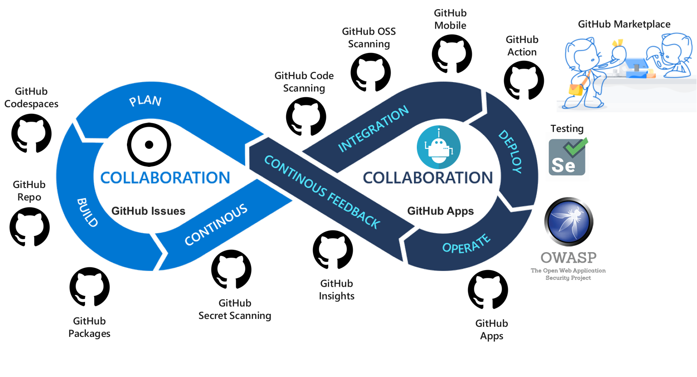

<!-- markdownlint-disable MD033 -->

<h1 align="center">GitHub DevSecOps Fundamentals</h1>
<h5 align="center">@igwejk @mouismail @ncalteen</h3>

  <a href="#mega-prerequisites">Prerequisites</a> •
  <a href="#books-resources">Resources</a> •
  <a href="#learning-objectives">Learning Objectives</a>

Goto >> https://reimagined-spork-wok19n1.pages.github.io/

This self-paced workshop and introduces you to the fundamentals of DevSecOps using GitHub.

For audiences at the start of their DevSecOps journey, the workshop addresses the following key concerns:

- How do I align the quest for high velocity delivery with the goals and visions of my organization?
- How do I efficiently develop a project and manage code?
- How do I securely package artifacts and store them for distribution?
- How do I securely deploy artifacts/packages?
- How do I generally automate processes in the business?

For the experts who are further along or advanced in their DevSecOps adoption journey, the workshop provides guidance and challenges you to reduce complications in the implementation of DevSecOps practices:

- How do I consolidate tools and remove complications due to tool-bloat?
- How do I simplify the software supply chain process?

This workshop is intended for the benefit of any audience who has interest in addressing the above concerns.

## Learning Objectives

- Understand DevSecOps
- Leverage GitHub as a complete platform for
  - Value Stream Management
  - Version Control
  - Securing the Software Supply Chain
  - Release Automation

## :mega: Prerequisites

- A GitHub account

  You may create a new GitHub account [here](https://github.com/join), if you do not already have one.

  > [!IMPORTANT]
  > Keep your @handle handy.
- A device with a browser with sufficient screen estate convenient for coding.
- [GitHub Codespaces](https://github.com/features/codespaces)

## Labs

- [ ] [1. Value Stream Management](./Value-Stream-Management/index.md)
- [ ] [2. Version Control](./Version-Control/index.md)
- [ ] [3. Software Supply Chain](./docs/Software-Supply-Chain/index.md)
- [ ] [4. Release Automation](./Release-Automation/index.md)

## :books: Resources

- Reference Workflow Archetype
- [Create diagrams to convey information through charts and graphs](https://docs.github.com/en/get-started/writing-on-github/working-with-advanced-formatting/creating-diagrams)
- [Include diagrams in your Markdown files with Mermaid](https://github.blog/2022-02-14-include-diagrams-markdown-files-mermaid/)
- [Security hardening for GitHub Actions](https://docs.github.com/en/actions/security-guides/security-hardening-for-github-actions)
- [Security harden deployments with OpenID Connect](https://docs.github.com/en/actions/deployment/security-hardening-your-deployments/about-security-hardening-with-openid-connect)
