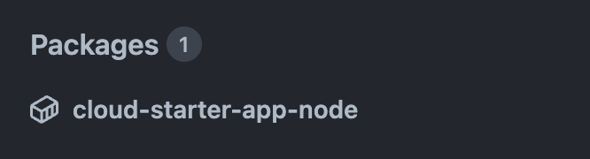
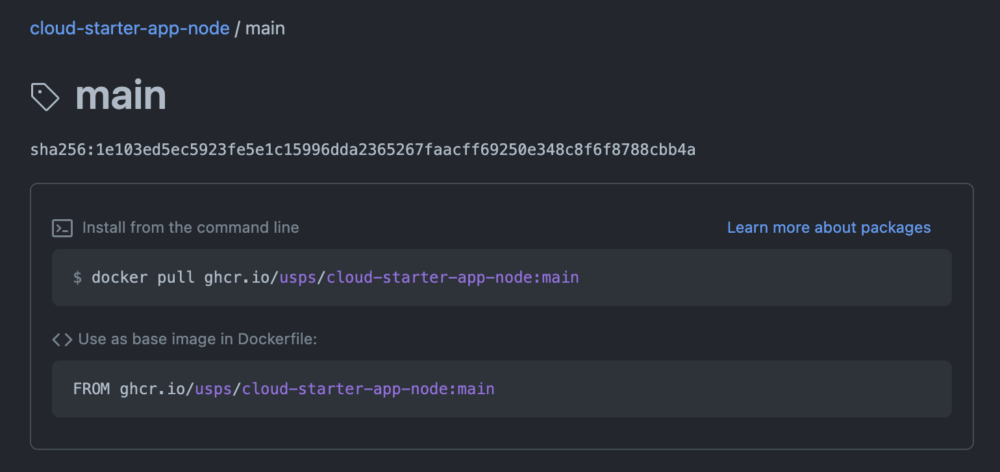

# End-to-End Development Workflow

Now that you have a Codespace, you can start working on your application! This
document will walk you through the end-to-end workflow of developing, testing,
and deploying your application.

## Step 1: Create a Feature Branch

1. In your codespace's terminal, run the following command

   > ![NOTE]
   >
   > Give your branch a descriptive name so it's easy to remember what you're
   > working on! Or, if it is to address a specific issue, include the issue
   > number.

   ```bash
   git checkout -b my-branch
   ```

## Step 2: Make Changes

At this point, you can start making changes to your application. To see those
changes, make sure to start the app first! The sample app can be started from
the terminal or the command palette.

From the terminal:

1. Run the following command

   ```bash
   poetry run flask run --host=0.0.0.0 --port=3000
   ```

From the command palette:

1. Press **Ctrl + Shift + P** to open the command palette
1. Enter `Tasks: Run Task`
1. Press **Enter**
1. Select `Python: Run App` from the list of options

You should see output like this:

Codespaces will detect that your app is running and prompt you to open it in a
new browser tab.

1. Click **Open in Browser**

   As you are making changes, make sure to refresh the new tab to see them.

## Step 3: Update the Version

This repository uses [Semantic Versioning (SemVer)](https://semver.org/) to
track releases. This means that any time you make a change to your application,
you will need to update the version number in
[`pyproject.toml`](./pyproject.toml).

1. Open [`pyproject.toml`](../pyproject.toml)
1. Update the `version` field

   > ![NOTE]
   >
   > The version number must be in the format `x.y.z`, where `x`, `y`, and `z`
   > are integers. For example, `1.0.0` or `2.1.3`.

## Step 4: Commit and Push

1. In your codespace's terminal, run the following command

   > ![NOTE]
   >
   > Check out [How to Write a Git Commit Message](https://cbea.ms/git-commit/)!

   ```bash
   git commit -am "My commit message"
   ```

1. Push your changes to GitHub

   ```bash
   git push
   ```

   If you encounter an error, you may need to set the upstream branch. Run the
   command again, this time including the `--set-upstream` parameter.

   ```bash
   git push --set-upstream origin my-branch
   ```

## Step 5: Verify Package Creation

Any time you push changes to your branch, the **Continuous Integration**
workflow will run. This workflow will build and test your project, and upload
the container image to GitHub Container Registry. The following image labeles
will be created:

| Label                     | Description                              |
| ------------------------- | ---------------------------------------- |
| `my-feature-<commit sha>` | The image built from the specific commit |
| `my-feature`              | The latest image built from the branch   |

1. Locate the **Packages** section of your repository

   

1. Click the package name (e.g. `cloud-starter-app-python`)
1. In the **Recent tagged image versions** section, locate that has been tagged
   with your branch name (e.g. `my-branch`)

   

## Step 6: Deploy to `dev`

Now that your image is available, you can deploy it to your `dev` environment!
If you are still testing this change, you can deploy it to `dev` using the
Rollout Deployment workflow.

1. Navigate to your **infrastructre** repository
1. Click the **Actions** tab
1. Click **Rollout Deployment to Azure**
1. Click **Run workflow**
1. In the **Deployment Environment** drop-down menu, select `dev`
1. In the **Deployment Image Label** field, enter your branch name (e.g.
   `my-branch`)
1. Click **Run workflow**

When the workflow completes, you can verify that your application is running by
navigating to the IP address of your deployment.

## Step 7: Create a Pull Request

When your changes are ready for review and release, you can open a pull request!

1. Navigate to your repository
1. Click the **Pull requests** tab
1. In the **compare** drop-down menu, select your branch (e.g. `my-branch`)
1. Click **Create pull request**
1. Enter a title and description for your PR
1. Click **Create pull request**
1. Click the cog icon next to the **Reviewers** section and add at least 1
   reviewer from your team
1. Click **assign yourself** to assign the PR to yourself
1. (Optional) Add any labels, projects, and milestones


## Step 8: Review Checks

Whenever you push changes to your branch, the **Continuous Integration** and
**Linter** workflows will run. You can view the results of these workflows by
clicking the **Checks** tab of your PR, or by clicking **Details** next to a
specific check.

## Step 9: Collaborate

Once your PR is open, you can collaborate with your team to review and test your
changes. You can also continue to push changes to your branch, which will
automatically update the PR.

## Step 10: Merge

Once your PR is approved, you can merge it into `main`. This will trigger the
**Continuous Delivery** workflow, which will build, test, and push your
container image to GitHub Container Registry.

1. Click **Merge pull request**
1. Click **Confirm merge**
1. Click **Delete branch**

## Step 11: Update Image Label

Now that a new image label has been created, you will need to update the
infrastructure repository to use it. This can be done by following the steps in
[Deployment](./deployment.md).
