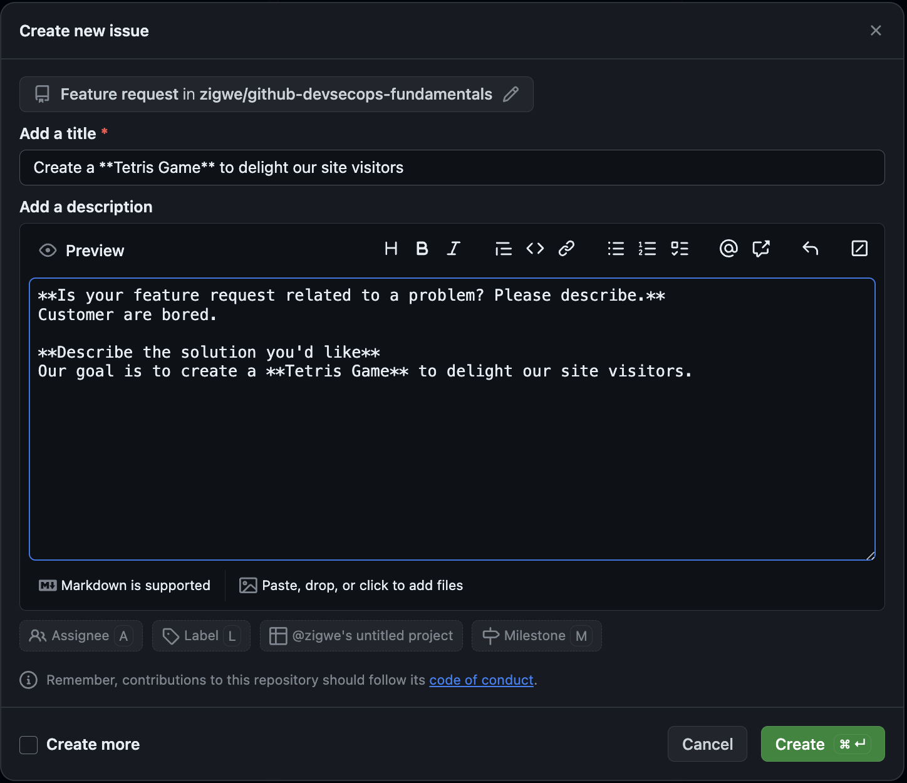

# :test_tube: Project Management

!!! quote ":moneybag: Facilitate tracking of business goal delivery"

    > _Our goal is to create a **Tetris Game** to delight our site visitors._

    1. Refer back to the project created in the [prerequisite to the workshop](../../../#prerequisites)
    2. Create an issue to capture the goal
       1. Select the **:octicons-project-16: Home** view
       2. Click on the **+** button
       3. Select **:octicons-issue-opened-16: Create new issue** from the drop down
       4. Choose **Feature request**
       5. Fill the form as follows and click Create

        
