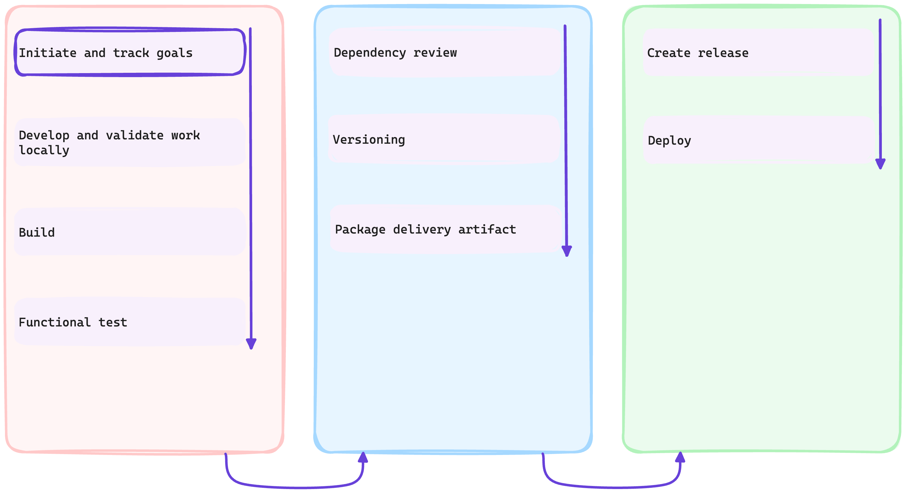

# :test_tube: Project Management

<!-- markdownlint-disable MD033 MD046 -->

!!! quote ":octicons-milestone-16: Facilitate collaborative tracking of business goal delivery"

    > _As part of the prerequisite steps, you had created a project management board. You will now build on that step and keep stakeholders in the loop through the full course of the development process._

    

---

## Exercise: Create an `issue` to capture the goal

!!! question "What is GitHub Issues?"

    Use GitHub Issues to track ideas, feedback, tasks, or bugs for work on GitHub.

    When you mention an issue in another issue or pull request, the issue's timeline reflects the cross-reference so that you can keep track of related work. To indicate that work is in progress, you can link an issue to a pull request. When the pull request merges, the linked issue automatically closes.

---

### **:material-numeric-1-circle: Refer back to the project created in the [prerequisite to the workshop](../../prerequisites.md#create-a-project-board-for-the-repository)**

---

### **:material-numeric-2-circle: Create an issue to capture the goal**

1. Identify the **:clipboard: Backlog** column
2. Click on **+ Add item** at the bottom of the column
3. Click on the **+** button
4. Select **:octicons-issue-opened-16: Create new issue** from the menu
5. Choose the repository you created earlier
6. Choose **Feature request** (1)
    { .annotate }

    1. The issue creation was facilitated with an 👀 [**issue template**](https://docs.github.com/en/communities/using-templates-to-encourage-useful-issues-and-pull-requests/about-issue-and-pull-request-templates#issue-templates).

        ```markdown title=".github/ISSUE_TEMPLATE/feature_request.md"
        --8<-- ".github/ISSUE_TEMPLATE/feature_request.md"
        ```

7. Fill the form. Feel free to be creative 🙂 with your inputs.

    !!! example "For the title..."
        You may for instance enter "_**Create a Tetris game to delight our site visitors**_".

    After filling the form in, click <span class="gh-button-green">Create <span style="font-size: 0.75em">:material-apple-keyboard-command::material-keyboard-return:</span></span> to create the issue. (1)
      { .annotate }

      1. Things you can do in an issue include but are not limited to
        - [**Assign**](https://docs.github.com/en/issues/tracking-your-work-with-issues/assigning-issues-and-pull-requests-to-other-github-users) the issue to yourself or other stakeholders.
        - [**Mention**](https://docs.github.com/en/get-started/writing-on-github/getting-started-with-writing-and-formatting-on-github/basic-writing-and-formatting-syntax#mentioning-people-and-teams) other stakeholders (people and teams) to notify them for awareness.

---

### **:material-numeric-3-circle: Take note of the issue number**

We will use the issue number to link the the issue to subsequent work later. If you are too curious and cannot wait, see 👀 [Linking a pull request to an issue](https://docs.github.com/en/issues/tracking-your-work-with-issues/linking-a-pull-request-to-an-issue).

Moreover, having created the issue, we can update the issue with comments to keep collaborating stakeholders in the loop.

---

## 📚 Resources

- [Project planning for developers](https://github.com/features/issues)
- [Planning and tracking work for your team or project](https://docs.github.com/en/issues/tracking-your-work-with-issues/planning-and-tracking-work-for-your-team-or-project)
- [Linking a pull request to an issue](https://docs.github.com/en/issues/tracking-your-work-with-issues/linking-a-pull-request-to-an-issue)
- [Create diagrams to convey information through charts and graphs](https://docs.github.com/en/get-started/writing-on-github/working-with-advanced-formatting/creating-diagrams)

---
