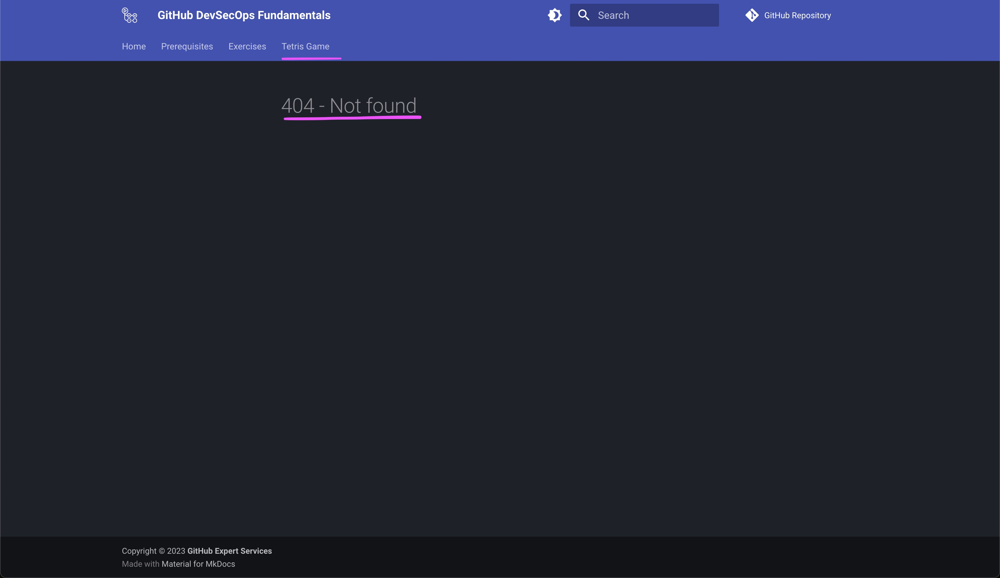

# :test_tube: Implement Features

!!! quote ":moneybag: Enable rapid onboarding to project development"

    > _Our goal is to create a **Tetris Game** to delight our site visitors._
    >
    > However, navigating to the **Tetris Game** page of the site shows that the feature is currently missing.
    > 

    ## Exercise: Integrate the Tetris Game

    1. Refer back to the Codespaces development environment created in the [prerequisite to the workshop](../../prerequisites.md#provision-a-new-cloud-development-environment-for-the-workshop).
    1. On the `TERMINAL` view at the bottom, notice that a local site server is already running.
    1. Looking at the build log in the terminal, you can also see the following warning

        
    1. On the `PORTS` view at the bottom, notice there is a `Site (8080)` entry in the table. You may right click on the entry to make the port public.

        This way other stakeholders can have live access to your ongoing work and can collaborate with timely feedbacks.
    1. Click the **:octicons-globe-16:** icon associated with `Site (8080)` entry to view the site in your browser
    1. Rename the `docs/.tetris.game` folder to `docs/tetris.game` without the `.` prefix
    1. Find and open the file `mkdocs.yml` in the File Explorer (it's at the root of the file tree)

          - Fix the  the Tetris Game relevant entry and point the value of the entry to the `tetris.game` folder

            ```yaml linenums="152" hl_lines="21"
            nav:
            - index.md
            - Prerequisites: prerequisites.md
            - Exercises:
                - Introduction: exercises/index.md
                - Collaborate:
                    - exercises/01.collaborate/index.md
                    - exercises/01.collaborate/01.md
                    - exercises/01.collaborate/02.md
                    - exercises/01.collaborate/03.md
                - Secure the Software Supply Chain:
                    - exercises/02.secure.the.software.supply.chain/index.md
                    - exercises/02.secure.the.software.supply.chain/00.md
                    - exercises/02.secure.the.software.supply.chain/01.md
                    - exercises/02.secure.the.software.supply.chain/02.md
                    - exercises/02.secure.the.software.supply.chain/02-extra.md
                - Automate-Release:
                    - exercises/03.automate.release/index.md
                    - exercises/03.automate.release/01.md
                    - exercises/03.automate.release/02.md
            - Tetris Game: tetris.game/index.html #(1)
            ```

            1.  Here, change `.tetris.game/index.html` to `tetris.game/index.html`.

    1. Observe the local build in the terminal and do a manual test of the integration
    1. Add automated checks by creating the following workflows

        ```yaml title=".github/workflows/1.1.continuous.integration.yml"
        --8<-- ".github.reference/workflows/1.1.continuous.integration.yml"
        ```

        ```yaml title=".github/workflows/1.2.continuous.integration.yml"
        --8<-- ".github.reference/workflows/1.2.continuous.integration.yml"
        ```
    1. Commit the changes to a new branch and push it

        ```bash
        git checkout -b integrate-tetris-game
        git add .
        git commit -m "Integrate tetris game"
        git push -u origin integrate-tetris-game
        ```
