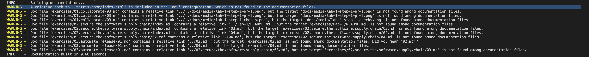
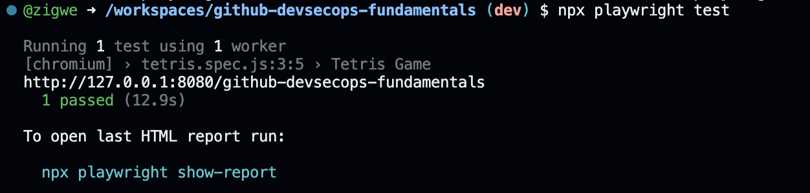

# :test_tube: Implement Features

!!! quote ":moneybag: Enable rapid onboarding to project development"

    > _Our goal is to create a **Tetris Game** to delight our site visitors, without losing time to complex project onboarding process nor complications due to tool-bloat._
    >
    > Currently, navigating to the **Tetris Game** page of the workshop site shows that the _feature_ is currently missing. We will address that issue in this exercise.
    >
    > 

    ## Exercise: Integrate the **Tetris Game**

    Refer back to the Codespaces development environment created in the [prerequisite to the workshop](../../prerequisites.md#provision-a-new-cloud-development-environment-for-the-workshop).(1)
    { .annotate }

    1. **:octicons-info-16:{ style="color: yellow" } Your Codespace may have stopped due to inactivity.**

        - _If the browser tab with your Codespace remains open and you can find it_, click <span class="gh-button-green">Restart codespace</span> to resume.
          
        - Otherwise, you can find it at the new repository you had created.
          

    ---

    ### **Explore**

    1. On the **`TERMINAL`** view at the bottom, notice that a local site server is already running.

           Looking at the build log in the terminal, you can see a warning like the one in the following example.(1)
           { .annotate }

           1. 💡 The warning gives a cue to addressing the Tetris Game integration issue. We shall implement the fix in later steps!

           

           :fire: The log `INFO` entry that reads **`INFO    -  [05:36:30] Watching paths for changes: 'docs', 'mkdocs.yml'`** informs you that the local site will rebuild whenever there is a change in the `docs` folder.

    ---

    ### **Develop locally**

    1. Switch to the **`PORTS`** view at the bottom panel, notice there is a **`Site (8080)`** entry in the table.

         1. Focus your :fontawesome-solid-hand-pointer: mouse pointer on the **`Site (8080)`** to reveal additional contexts.
         2. Click the **:material-file-search-outline: Preview in Editor** icon to browse the local build of the site inside of the editor's browser.(1)
           { .annotate }

             1. - :warning: **Only you currently have access to the published site.**
                - :bulb: You may instead click the **:octicons-globe-16:** icon associated with **`Site (8080)`** entry to view the site in your normal browser.

            To open access to other stakeholder

            1. Right click on the **`Site (8080)`** entry
            2. In the popup menu, set the mouse pointer on the **Port Visibility** item and select the **Public** option.
                { style="width: 40em" }

            !!! tip ":octicons-goal-16:{ style="color: red" } Facilitate Collaboration"

                Now, other stakeholders you share the site URL with can access the site. Consequently, they can also assess your ongoing work and can collaborate with timely feedbacks.

    1. Rename the **`docs/.tetris.game`** folder to **`docs/tetris.game`**, i.e. simply remove the `.` prefix from the name.
    1. Find and open the file **`mkdocs.yml`** in the File Explorer (it's at the root of the file tree)

          - Fix the the `Tetris Game` relevant entry and point the value of the entry to the `tetris.game` folder

            ```yaml linenums="153" hl_lines="20"
            nav:
            - index.md
            - Prerequisites: prerequisites.md
            - Exercises:
                - Introduction: exercises/index.md
                - Collaborate:
                    - exercises/01.collaborate/index.md
                    - exercises/01.collaborate/01.md
                    - exercises/01.collaborate/02.md
                    - exercises/01.collaborate/03.md
                - Secure the Software Supply Chain:
                    - exercises/02.secure.the.software.supply.chain/index.md
                    - exercises/02.secure.the.software.supply.chain/00.md
                    - exercises/02.secure.the.software.supply.chain/01.md
                    - exercises/02.secure.the.software.supply.chain/02.md
                    - exercises/02.secure.the.software.supply.chain/02-extra.md
                - Automate-Release:
                    - exercises/03.automate.release/index.md
                    - exercises/03.automate.release/01.md
            - Tetris Game: tetris.game/index.html #(1)
            ```

            1.  Here, change `.tetris.game/index.html` to `tetris.game/index.html`.

    ---

    ### **Test**

    #### **Manual Test**

    1. Observe the local build in the terminal, there should not be any :warning: `WARNING` in the log.
    2. Manually confirm that the Tetris Game integration was effective.
       

    #### **Automated Test**

    1. Implement a standardized automated functional test to enable quality checks in the team at high velocity.

        Open the terminal and install test dependencies.(1)
        { .annotate }

        1. 💡 You can create additional terminal session by clicking :octicons-plus-16: at the top right side of the **`TERMINAL`** panel.

        ```shell
        nvm install --lts #(1)
        npm install
        npx playwright install --with-deps chromium #(2)
        ```
        { .annotate }

        1. :octicons-info-16: A codespace environment can be customized as needed. In this case, we customized the running session by installing the latest version of NodeJS.
        2. :octicons-info-16: This command installs browsers required for the functional test. **Please be patient, it may take 1 to 2 minutes to complete the installation.**

        Then implement the functional test as follows.

        ```javascript title="tests/tetris.spec.js"
        --8<-- "reference.implementations/tests/tetris.spec.js"
        ```

        Finally execute the automated test.

        ```shell
        npx playwright test
        ```

        When everything has been done right, the test should pass.
        

    2. Add automated checks by creating the following workflows

        ```mermaid
        sequenceDiagram
            participant GA as GitHub Actions

            activate GA
            GA-->>GA: Compile
            GA-->>GA: Build
            GA-->>GA: Unit Test
            GA-->>GA: Integration Test
            GA-->>GA: Code Scanning (CodeQL, Trivy)
            GA-->>GA: Dependency Review
            deactivate GA
        ```

        ```yaml title=".github/workflows/1.1.continuous.integration.yml"
        --8<-- "reference.implementations/workflows/1.1.continuous.integration.yml"
        ```

        ```yaml title=".github/workflows/1.2.continuous.integration.yml"
        --8<-- "reference.implementations/workflows/1.2.continuous.integration.yml"
        ```

    ---

    3. Commit the changes to a new branch and publish it for a review.

        ```bash
        git checkout -b continuous-deployment
        git add .
        git commit -m "Integrate tetris game"
        git push -u origin continuous-deployment
        ```
