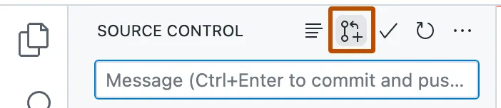
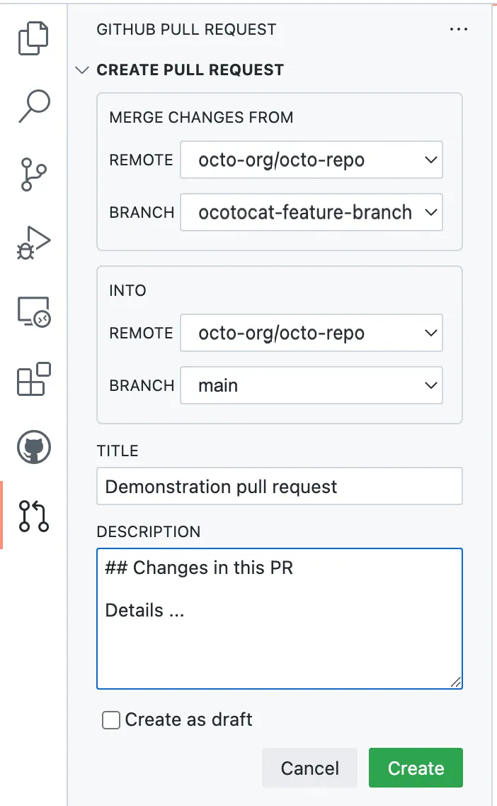

# :test_tube: Implement Features

<!-- markdownlint-disable MD033 MD046 -->

!!! quote ":moneybag: Enable rapid onboarding to project development"

    > _Our goal is to create a **Tetris Game** to delight our site visitors, without losing time to complex project onboarding process nor complications due to tool-bloat._
    >
    > Currently, navigating to the **Tetris Game** page of the workshop site shows that the _feature_ is currently missing. We will address that issue in this exercise.
    >
    > 

## Exercise: Integrate the **Tetris Game**

Refer back to the Codespaces development environment created in the [prerequisite to the workshop](../../prerequisites.md#provision-a-new-cloud-development-environment-for-the-workshop).(1)
{ .annotate }

1. **:octicons-info-16:{ style="color: pink" } Your Codespace may have stopped due to inactivity.** Do not worry, it is quite easy to get back on track...

      - _If the browser tab with your Codespace remains open and you can find it_, click <span class="gh-button-green">Restart codespace</span> to resume.
        
      - Otherwise, you can find it at the new repository you had created.
        

---

### **:material-numeric-1-circle: Explore your Codespace**

=== "1.1 Understand Your Codespace"

    `.devcontainer/devcontainer.json` describes the provisioning of your codespace. Some of the configuration entries are explained below, with annotations next to the respective entry. You can learn more about the [Development Container Specification](https://containers.dev/implementors/spec/) at your convenience.

    ```json title=".devcontainer/devcontainer.json" linenums="1" hl_lines="11"
    {
      "hostRequirements": { /*(1)*/
        "cpus": 4,
        "memory": "16gb",
        "storage": "32gb"
      },
      "build": {
        "dockerfile": "./Dockerfile", /*(2)*/
        "context": ".."
      },
      "postAttachCommand": "python -m mkdocs serve --clean --dev-addr 127.0.0.1:8080", /*(3)*/
      "forwardPorts": [
        8080
      ],
      "containerEnv": {
        "TETRIS_APP_HOST": "127.0.0.1",
        "TETRIS_APP_PORT": "8080",
        "TETRIS_APP_PATH": "github-devsecops-fundamentals"
      },
      ...
    ```

    1. You can customize the compute resource to be made available for the Codespace environment, to suit your project.
    2. A `Dockerfile` can be used to customize the Codespace container image, for instance you may choose to consistently pre-install dependencies required for the development environment.
    3. Tasks may be configured to be executed at the start of each development session e.g. running a development server.

    {==

    On the **`TERMINAL`** view at the bottom, notice that a local site server is already running. **This is as a result of the `postAttachCommand` configuration entry in `.devcontainer/devcontainer.json`**.

    Looking at the build log in the terminal, you can see a warning like the one in the following example.(1)
    { .annotate }

    1. 💡 The warning gives a cue to addressing the Tetris Game integration issue. We shall implement the fix in later steps!

    

    :fire: The log `INFO` entry that reads **`INFO    -  [05:36:30] Watching paths for changes: 'docs', 'mkdocs.yml'`** informs you that thelocal site will rebuild whenever there is a change in the `docs` folder.

    ==}

=== "1.2 Enable Quick Collaboration Feedback"

    Switch to the **`PORTS`** view on the bottom panel, notice there is a **`Site (8080)`** entry in the table.

    1. Focus your :fontawesome-solid-hand-pointer: mouse pointer on the **`Site (8080)`** to reveal additional contexts.
    1. Click the **:material-file-search-outline: Preview in Editor** icon to browse the local build of the site inside of the editor's browser.(1)
        { .annotate }

          1. - :warning: **Only you currently have access to the published site.**
             - :bulb: You may instead click the **:octicons-globe-16:** icon associated with **`Site (8080)`** entry to view the site in your normal browser.

    **Open access to other stakeholders for collaboration.**

    1. Right click on the **`Site (8080)`** entry
    1. In the popup menu, set the mouse pointer on the **Port Visibility** item and select the **Public** option.
        { style="width: 40em" }

    {==

    :octicons-goal-16:{ style="color: pink" } Now, other stakeholders you share the site URL with can access the site. **Consequently, they can also assess your ongoing work and can collaborate with timely feedbacks.**

    ==}

---

### **:material-numeric-2-circle: Implement Automated Checks**

GitHub as a platform, is event-driven. Beyond the ordinary, you can generally automate your actual business processes by modelling activities to produce changes on GitHub, thus triggering execution of certain automated tasks depending on the nature of a change.

At this fundamentals phase of introduction to DevSecOps, we shall focus our leverage of GitHub's powerful event system to drive {== **continuous integration** ==} checks and tests with GitHub Workflows.

=== "2.1 Learn GitHub Actions"

    !!! info "What is GitHub Actions?"

        GitHub Actions is a continuous integration and continuous delivery (CI/CD) platform that allows you to automate your build, test, and deployment pipeline. You can create workflows that build and test every pull request to your repository, or deploy merged pull requests to production.

        GitHub Actions goes beyond just DevOps and lets you run workflows when other events happen in your repository. For example, you can run a workflow to automatically add the appropriate labels whenever someone creates a new issue in your repository.

        GitHub provides Linux, Windows, and macOS virtual machines to run your workflows, or you can host your own self-hosted runners in your own data center or cloud infrastructure.

        ~ [Understanding GitHub Actions](https://docs.github.com/en/actions/learn-github-actions/understanding-github-actions)

    ```yaml title="Anatomy of a GitHub Workflow"
    name: Learn GitHub Actions #(1)

    run-name: ${{ github.actor }}  is learning GitHub Actions #(2)

    on: [push] #(3)

    permissions: #(12)
        contents: read

    env: #(13)
        LEARNER_NAME: Igwe

    jobs: #(4)

        check-bats-version: #(5)

            runs-on: ubuntu-latest #(6)

            steps: #(7)

                - uses: actions/checkout@v4 #(8)

                - uses: actions/setup-node@v3 #(9)
                  with:
                      node-version: '14'

                - run: npm install -g bats #(10)

                - run: bats -v #(11)

                - run: echo "Hey ${LEARNER_NAME}, you're good... You've mastered GitHub Actions\!"
    ```

    1. `Optional` - The name of the workflow as it will appear in the "Actions" tab of the GitHub repository. If this field is omitted, the name of the workflow file will be used instead.
    2. `Optional` - The name for workflow runs generated from the workflow, which will appear in the list of workflow runs on your repository's "Actions" tab. This example uses an expression with the `github` context to display the username of the actor that triggered the workflow run. For more information, see "[Workflow syntax for GitHub Actions](https://docs.github.com/en/actions/using-workflows/workflow-syntax-for-github-actions#run-name)."
    3. Specifies the trigger for this workflow. This example uses the `push` event, so a workflow run is triggered every time someone pushes a change to the repository or merges a pull request.  This is triggered by a push to every branch; for examples of syntax that runs only on pushes to specific branches, paths, or tags, see "[Workflow syntax for GitHub Actions](https://docs.github.com/en/actions/reference/workflow-syntax-for-github-actions#onpushpull_requestpull_request_targetpathspaths-ignore)."
    4. Groups together all the jobs that run in the `learn-github-actions` workflow.
    5. Defines a job named `check-bats-version`. The child keys will define properties of the job.
    6. Configures the job to run on the latest version of an Ubuntu Linux runner. This means that the job will execute on a fresh virtual machine hosted by GitHub. For syntax examples using other runners, see "[Workflow syntax for GitHub Actions](https://docs.github.com/en/actions/reference/workflow-syntax-for-github-actions#jobsjob_idruns-on)"
    7. Groups together all the steps that run in the `check-bats-version` job. Each item nested under this section is a separate action or shell script.
    8. The `uses` keyword specifies that this step will run `v4` of the `actions/checkout` action. This is an action that checks out your repository onto the runner, allowing you to run scripts or other actions against your code (such as build and test tools). You should use the checkout action any time your workflow will use the repository's code.

        !!! info ""

            Actions are the building blocks that power your workflow. A workflow can contain actions created by the community, or you can create your own actions directly within your application's repository.

            To learn more, see:

            - [Finding and customizing actions](https://docs.github.com/en/actions/learn-github-actions/finding-and-customizing-actions)
            - [About custom actions](https://docs.github.com/en/actions/creating-actions/about-custom-actions)

    9. This step uses the `actions/setup-node@v3` action to install the specified version of the Node.js. (This example uses version 14.) This puts both the `node` and `npm` commands in your `PATH`.
    10. The `run` keyword tells the job to execute a command on the runner. In this case, you are using `npm` to install the `bats` software testing package.
    11. Finally, you'll run the `bats` command with a parameter that outputs the software version.
    12. At the start of each workflow job, GitHub automatically creates a unique `GITHUB_TOKEN` secret to use in your workflow. You can use the `GITHUB_TOKEN` to authenticate in the workflow job.

        When you enable GitHub Actions, GitHub installs a GitHub App on your repository. The `GITHUB_TOKEN` secret is a GitHub App installation access token. You can use the installation access token to authenticate on behalf of the GitHub App installed on your repository. The token's permissions are limited to the repository that contains your workflow.

        {==

        **You can modify the permissions for the `GITHUB_TOKEN` in individual workflow files. If the default permissions for the `GITHUB_TOKEN` are restrictive, you may have to elevate the permissions to allow some actions and commands to run successfully. If the default permissions are permissive, you can edit the workflow file to remove some permissions from the `GITHUB_TOKEN`. As a good security practice, you should grant the `GITHUB_TOKEN` the least required access.**

        ==}

        Learn more about the default [Permissions for the `GITHUB_TOKEN`](https://docs.github.com/en/actions/security-guides/automatic-token-authentication).
    13. This defines a `map` of variables that are available to the steps of all jobs in the workflow. You can also set variables that are only available to the steps of a single job or to a single step. Learn more at [Defining environment variables for a single workflow](https://docs.github.com/en/actions/learn-github-actions/variables).

=== "2.2 Implement Automated Pull Request Checks"

    !!! info "What is a Pull Request (also known as PR)?"

        Pull requests let you tell others about changes you've pushed to a branch in a repository on GitHub. Once a pull request is opened, you can discuss and review the potential changes with collaborators and add follow-up commits before your changes are merged into the base branch.

        ~ [About pull requests](https://docs.github.com/en/pull-requests/collaborating-with-pull-requests/proposing-changes-to-your-work-with-pull-requests/about-pull-requests)

    To enable quality checks in the project at high velocity, implement a workflow that standardizes automated checks as follows.

    ```yaml title=".github/workflows/1.1.continuous.integration.yml" linenums="1" hl_lines="47-53 55-57 59-60"
    --8<-- "reference.implementations/workflows/1.1.continuous.integration.yml"
    ```

    {==

    Three checks have been implemented above:

      - **Code scanning with CodeQL**

          Code scanning is a feature that you use to analyze the code in a GitHub repository to find security vulnerabilities and coding errors. Any problems identified by the analysis are shown in GitHub.

          You can use code scanning to find, triage, and prioritize fixes for existing problems in your code. Code scanning also prevents developers from introducing new problems. You can schedule scans for specific days and times, or trigger scans when a specific event occurs in the repository, such as a push.

          If code scanning finds a potential vulnerability or error in your code, GitHub displays an alert in the repository. After you fix the code that triggered the alert, GitHub closes the alert.

      - **Build**

          The site is built with the `--strict` option, such that the occurrence of any `WARNING` results in a failed check. As it is, we can expect the automated checks to flag the pull request as non-compliant at this step.

      - **Functional test**

          Provided the build step had been successful, this next step tests the correctness of the feature implementation in accordance to customer-value expectations. So far, we should not get to this point in the workflow run as the **`Build` should have failed because the Tetris game feature implementation has not been completed**.

    ==}

    ??? quote "Optionally Implement Merge Queue for GitHub **_Enterprise_**"

        !!! info "What is a Merge Queue?"

            A merge queue helps increase velocity by automating pull request merges into a busy branch and ensuring the branch is never broken by incompatible changes.

            The merge queue provides the same benefits as the Require branches to be up to date before merging branch protection, but does not require a pull request author to update their pull request branch and wait for status checks to finish before trying to merge.

            Using a merge queue is particularly useful on branches that have a relatively high number of pull requests merging each day from many different users.

            Once a pull request has passed all required branch protection checks, a user with write access to the repository can add the pull request to the queue. The merge queue will ensure the pull request's changes pass all required status checks when applied to the latest version of the target branch and any pull requests already in the queue.

            📚 Learn more...

            - [Managing a merge queue](https://docs.github.com/en/repositories/configuring-branches-and-merges-in-your-repository/configuring-pull-request-merges/managing-a-merge-queue)
            - [Merging a pull request with a merge queue](https://docs.github.com/en/pull-requests/collaborating-with-pull-requests/incorporating-changes-from-a-pull-request/merging-a-pull-request-with-a-merge-queue)

        The previously implemented pull request checks will be executed in isolation. However, to provide assurance of stability on the target branch as different changes are being introduced to it at a fast pace by multiple collaborators, we want to aggregate isolated changes and re-validate them in batches i.e. the Merge Queue.

        !!! question "Is this like a _Daily Build_?"

            You probably recognize this concept as similar to the implementation of a daily/nightly build. **Except you do not have to wait ~ 24 hours or there about to validate your project's quality status.**

        !!! note ":octicons-git-merge-queue-16:{ .lg .middle } **Configure Merge Queue**"

            A Merge Queue is ideal for rolling out continuous integration at scale, enabling larger projects and teams to be optimally productive -- delivering high quality value without compromising product stability.

            {==

            You can reserve execution of expensive checks in a merge queue, to save cost and time.

            ==}

            To effectively leverage Merge Queue, you must first configure your repository to require it for pull requests as follows.

            1. On GitHub.com, navigate to the main page of the repository you have created.
            1. Under your repository name, click :octicons-gear-16: **Settings**. If you cannot see the "Settings" tab, select the  dropdown menu, then click **Settings**.
                
            1. In the "Code and automation" section of the sidebar, click :octicons-git-branch-16: **Branches**.
            1. Next to "Branch protection rules", click **Add branch protection rule**.
            1. Under "Branch name pattern", type the branch name **`main`** for the branch you want to protect.
            1. Select **Require merge queue**.
            1. Click <span class="gh-button-green">Create</span> to complete Merge Queue configuration

        Finally implement the checks in merge queue as follows.

        ```yaml title=".github/workflows/1.2.continuous.integration.yml"
        --8<-- "reference.implementations/workflows/1.2.continuous.integration.yml"
        ```

=== "2.3 Publish the changes"

    1. Commit and push the changes.

        ```bash
        git checkout -b feature/tetris-game
        git add .github/workflows/1.1.continuous.integration.yml
        # If you are doing the workshop with an enterprise account
        # and have opted to implement merge queue then you should also
        # add the merge queue workflow by uncommenting the next line.
        # git add .github/workflows/1.2.continuous.integration.yml
        git commit -m "Implement continuous integration"
        git push -u origin feature/tetris-game
        ```

    1. Once you've committed changes to your local copy of the repository, click the Create Pull Request icon.

        { style="width: 25em" }

        Check that the local branch and repository you're merging from, and the remote branch and repository you're merging into, are correct. Then give the pull request a title and a description.

        { style="height: 25em" }

    1. The pull request you created will be listed at `https://github.com/<YOUR-HANDLE>/github-devsecops-fundamentals/pulls`.

        {==

        Opening the pull request for exploration you should observe the following

        - **:octicons-comment-discussion-16: Conversation**

            Particularly enables and summarizes discussions/reviews on your changes with other collaborators and stakeholders. And additionally summarizes outcome of checks on the pull request.
        - **:octicons-git-commit-16: Commits**

            Summarizes all the commits contributing to the pull request.

        - **:octicons-checklist-16: Checks**

            Lists the checks run on the pull request and their respective outcomes.

        - **:octicons-file-diff-16: Files changed**

            Shows a `diff` of files modified and added due to the pull request.

        ==}

---

### **:material-numeric-3-circle: Implement Feature Changes**

The `Build` step in the previously implemented automated checks should identify a failure ultimately pointing to incompletion of the expected Tetris game feature. In the current phase, we will take steps to integrate the Tetris game as follows.

1. Rename the **`docs/.tetris.game`** folder to **`docs/tetris.game`**, i.e. simply remove the `.` prefix from the name.
2. Find and open the file **`mkdocs.yml`** in the File Explorer (it's at the root of the file tree)

   - Confirm that the `Tetris Game` relevant entry points to an index file in the `tetris.game` folder

     ```yaml linenums="153" hl_lines="20"
     nav:
       - index.md
       - Prerequisites: prerequisites.md
       - Exercises:
           - Introduction: exercises/index.md
           - Collaborate:
               - exercises/01.collaborate/index.md
               - exercises/01.collaborate/01.md
               - exercises/01.collaborate/02.md
               - exercises/01.collaborate/03.md
           - Secure the Software Supply Chain:
               - exercises/02.secure.the.software.supply.chain/index.md
               - exercises/02.secure.the.software.supply.chain/00.md
               - exercises/02.secure.the.software.supply.chain/01.md
               - exercises/02.secure.the.software.supply.chain/02.md
               - exercises/02.secure.the.software.supply.chain/02-extra.md
           - Automate-Release:
               - exercises/03.automate.release/index.md
               - exercises/03.automate.release/01.md
       - Tetris Game: tetris.game/index.html
     ```

#### **Manual Test**

1. Observe the local build in the terminal, there should not be any :warning: `WARNING` in the log.
1. Manually confirm that the Tetris Game integration was effective.
   

#### **Automated Test**

Before publishing our new changes, we will implement and execute a functional test to validate the feature implementation.

1. Open the terminal and install test dependencies.(1)
   { .annotate }

    1. 💡 You can create additional terminal session by clicking :octicons-plus-16: at the top right side of the **`TERMINAL`** panel.

    ```shell
    # Install Node.js
    nvm install --lts #(1)
    # Install packages required for running the functional UI test
    npm install
    # Install the browser(s) against which the functional UI test should run
    npx playwright install --with-deps chromium #(2)
    ```

       1. :octicons-info-16: A codespace environment can be customized as needed. In this case, we customized the running session by installing the latest version of `Node.js`.
       2. :octicons-info-16: This command installs browsers required for the functional test. **Please be patient, it may take 1 to 2 minutes to complete the installation.**

    Then implement the functional test as follows.

    ```javascript title="tests/tetris.spec.js"
    --8<-- "reference.implementations/tests/tetris.spec.js"
    ```

    Finally execute the automated test.

    ```shell
    npx playwright test
    ```

    When everything has been done right, the test should pass.
    

1. Commit the changes to the current `feature/tetris-game` branch and publish it for a review.

    ```bash
    # Add newly implemented and modified files
    git add docs/tetris.game docs/.tetris.game mkdocs.yml tests/tetris.spec.js
    git commit -m "Integrate Tetris game implementation"
    git push origin
    ```

## 📚 Resources

- [Introduction to dev containers](https://docs.github.com/en/codespaces/setting-up-your-project-for-codespaces/adding-a-dev-container-configuration/introduction-to-dev-containers)
- [Workflow syntax for GitHub Actions](https://docs.github.com/en/actions/using-workflows/workflow-syntax-for-github-actions#jobsjob_idenv)
- [Finding and customizing actions](https://docs.github.com/en/actions/learn-github-actions/finding-and-customizing-actions)
- [Code scanning](https://docs.github.com/en/code-security/code-scanning)
