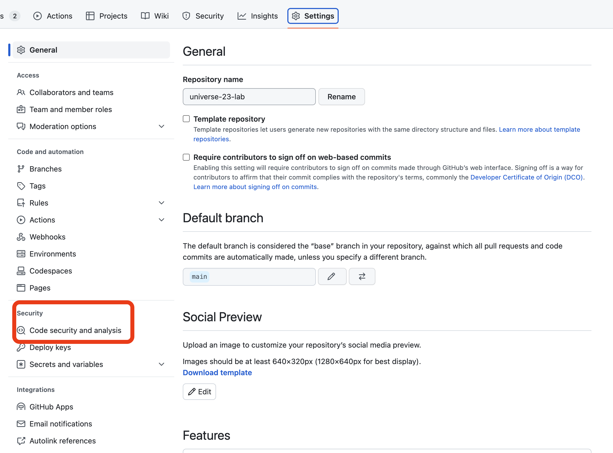
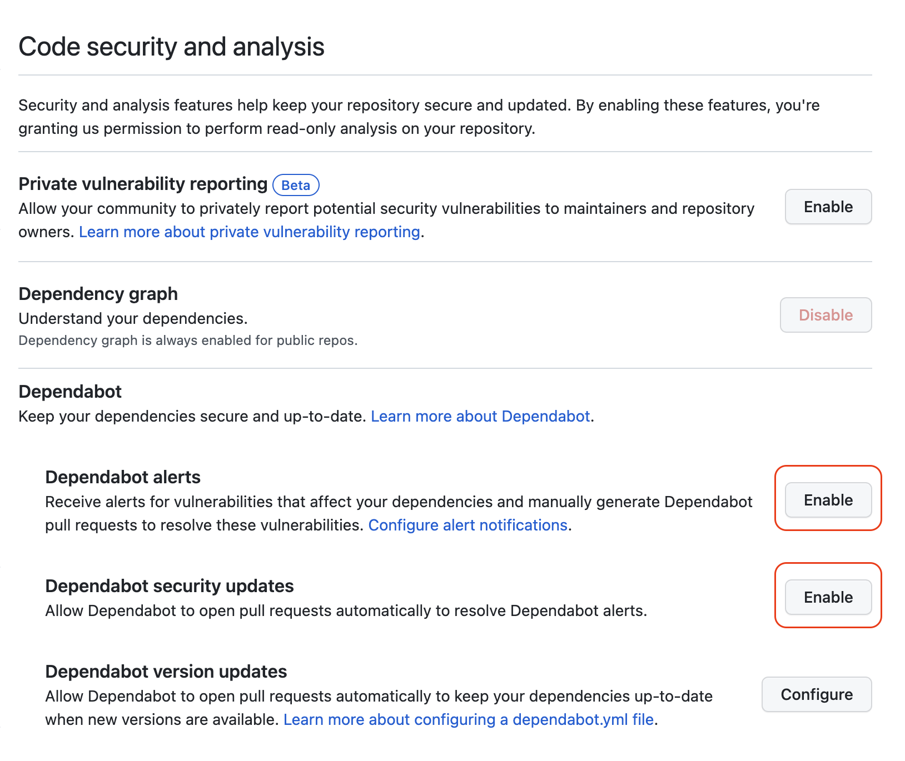
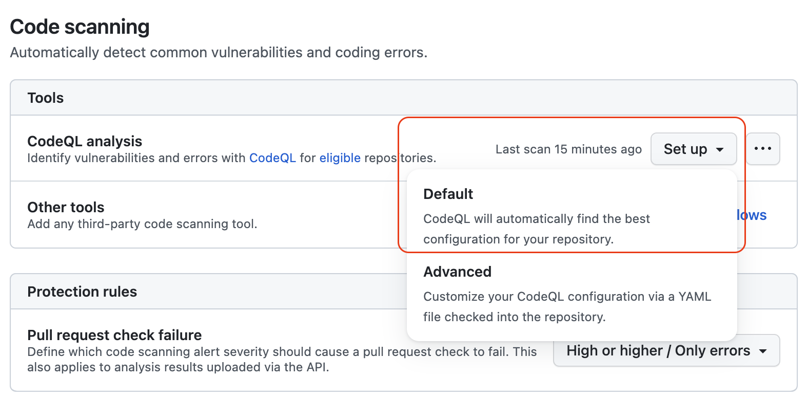
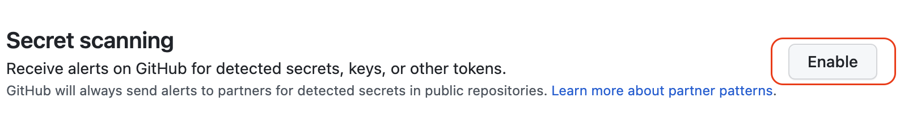

# :test_tube: Security Checks

In this part we will add to the continuous integration workflow the security checks.

- _**Objective:**_ Add security checks to the continuous integration workflow.
- _**Estimated completion time:**_ 10 minutes
- _**Outcome:**_ The continuous integration workflow will run the security checks on the Pull Request

!!! note
    We will continue working on the same branch `contiuous-integration-deployment` and the same file `01.1.continuous.integration.yml`.

## :books: Resources

- [GitHub Actions](https://docs.github.com/en/actions)
- [GitHub Actions - Workflow syntax for GitHub Actions](https://docs.github.com/en/actions/reference/workflow-syntax-for-github-actions)

## :pencil: Lab

### Step 1. Enable Enable GHAS (GitHub Advanced Security) checks on GitHub Repository

!!! note
    You must have admin permissions on the repository to perform this step.

1. Navigate to the repository settings.
2. Select the tab `Security & analysis`.

      

3. Enable `Dependabot`

   - Click on the button <span style="background-color: green; font-weight: bold; padding: 0.25em 0.75em; border-radius: 0.5em">Enable</span> `Dependabot alerts`.
   - Click on the button <span style="background-color: green; font-weight: bold; padding: 0.25em 0.75em; border-radius: 0.5em">Enable</span> `Dependabot security updates`.

       

4. Enable `Code scanning`.

   - Click on the button <span style="background-color: green; font-weight: bold; padding: 0.25em 0.75em; border-radius: 0.5em">Set up</span> for `CodeQL analysis` and select <span style="background-color: green; font-weight: bold; padding: 0.25em 0.75em; border-radius: 0.5em">Default</span>.

      

5. Enable `Secret scanning`.

   - Click on the button <span style="background-color: green; font-weight: bold; padding: 0.25em 0.75em; border-radius: 0.5em">Enable</span> for `Secret scanning`.

     

### Step 2. Add security checks to the continuous integration workflow

1. Navigate to `.github/workflows` and open the file `01.1.continuous.integration.yml`.
2. Add the following content to the file on line `68`:
!!! example "Security Checks"
      ``` yaml
        security-checks:
        runs-on: ubuntu-latest
        steps:
        - uses: actions/checkout@v3
        - uses: actions/setup-python@v4
          with:
            python-version: 3.12
        - uses: actions/setup-node@v3
          with:
            node-version: 20
        - name: Install Python dependencies
          run: |
            python -m pip install --upgrade pip
            pip install -r requirements.txt
        - name: Install node dependencies
          run: npm ci
        - name: Dependency Review
          uses: actions/dependency-review-action@v3
          with:
            config-file: ./.github/dependency-review-config.yml
      ```
!!! example "Push changes to Github"
       ``` bash
       git add .
       git commit -m "feat: update continuous integration workflow - add security checks step"
       git push origin continuous-integration-deployment
       ```

Nagivate to the repository on GitHub and open the pull request.
