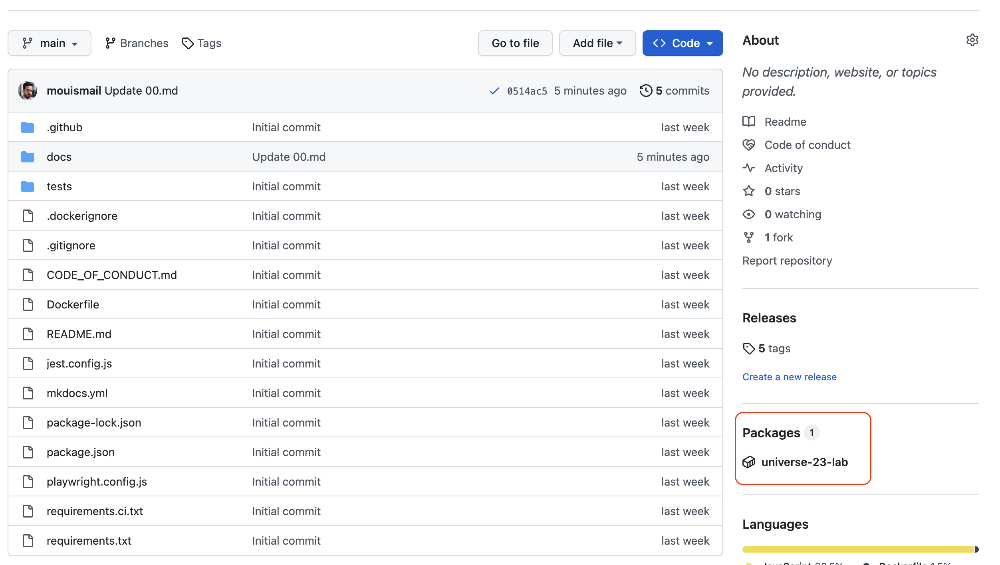

# :test_tube: Extra: Packing The Application

In this step we will containerize the application using Docker and push to GitHub Container Registry.

- _**Objective:**_ Containerize the application using Docker and push to GitHub Container Registry.
- _**Estimated completion time:**_ 5 minutes
- _**Outcome:**_ The application will be containerized and pushed to GitHub Container Registry.

!!! Note
    We will continue working on the same branch `continuous-deployment`.

## :books: Resources

- [Docker](https://www.docker.com/)
- [GitHub Container Registry](https://docs.github.com/en/packages/guides/about-github-container-registry)

## :pencil: Lab

1. Navigate to `.github/workflows` and open the file `03.extra.container.image.packaging.yml`.
2. Add the following content to the file:
!!! example "Package Delivery Artifacts"

      ```yaml
      --8<-- "docs/exercises/02.secure.the.software.supply.chain/workflows/04.docker.yml"
      ```

!!! example "Push changes to Github"

    ```bash
    git add .
    git commit -m "feat: update continuous integration workflow - add security checks step"
    git push origin continuous-deployment
    ```

---
- Navigate to the repository on GitHub and open a pull request.
- After the workflow is finished, navigate to the [GitHub Container Registry](https://docs.github.com/en/packages/guides/about-github-container-registry) and verify that the container image was pushed successfully.

    
