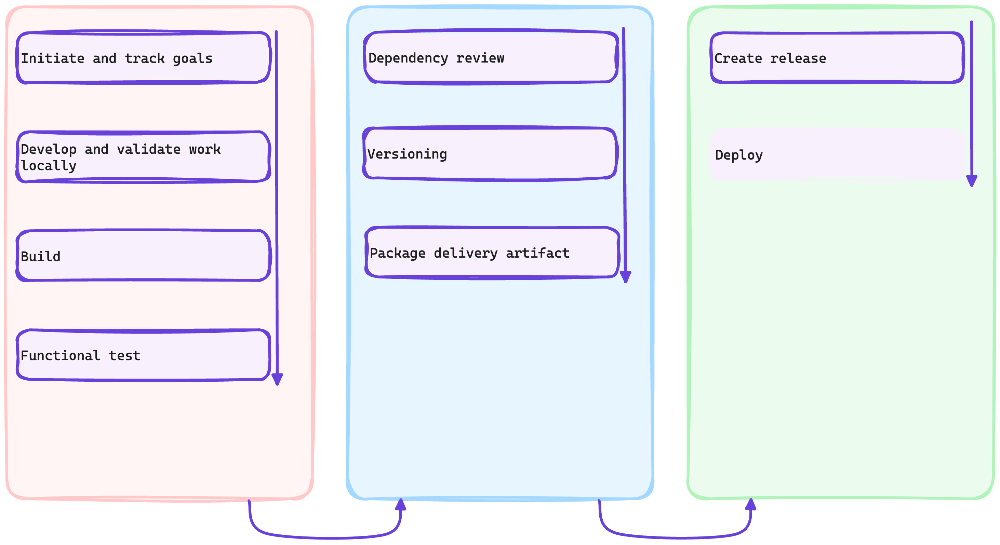

# :test_tube: Release Version

<!-- markdownlint-disable MD046 -->

!!! quote ":octicons-milestone-16: Release"

    > As streams of changes make it into the _production_ branch and are versioned in batches, an essential part of continuous delivery/deployment is to produce artifacts from versions which can then be deployed to various targets.
    >
    > Releases are deployable software iterations you can package and make available for a wider audience to download and use.
    >
    > How do we determine when to create a release? Let's see...

    

---

## Exercise: Create a Release of Versions

As you can guess already, GitHub provides an event that encapsulates the activity of creating a tag and pushing it to a repository. We will automate addressing such events, so that we can create a release when necessary.

---

### **:material-numeric-1-circle: Implement Release Creation**

In the file explorer, create a new workflow `.github/workflows/continuous.delivery.yml` as follows.

```yaml title=".github/workflows/continuous.delivery.yml" linenums="1" hl_lines="3-6 29-34 39-43 45-70 72-81 83-105"
--8<-- "reference.implementations/workflows/2.2.continuous.delivery.yml"
```

---

#### Analysis

- **Lines `3 - 6`**

    The release creation workflow will be triggered by tag pushes and when the pushed tag version is suffixed with the `-release` metadata.

- **Lines `29 - 34`**

    In the two steps included here, the site is built and archived as a release artifact.

- **Lines `39 - 43`**

    A GitHub App will be used as the actor for the operations we shall be executing. Hence the `actions/create-github-app-token@v1` action is used here to generate an authorization token for the app.

    !!! question "What is a GitHub App?"
        GitHub Apps, much _like_ `service accounts` and `bots`, are tools that extend GitHub's functionality. You can build a GitHub App to provide flexibility and reduce friction in your processes, {== without needing to sign in a user or create a service account ==}. GitHub Apps can do things on GitHub like open issues, comment on pull requests, and manage projects. They can also do things outside of GitHub based on events that happen on GitHub. For example, a GitHub App can post on Slack when an issue is opened on GitHub.

    > _When you use the repository's `GITHUB_TOKEN` to perform tasks, events triggered by the `GITHUB_TOKEN`, with the exception of workflow_dispatch and repository_dispatch, will not create a new workflow run. This prevents you from accidentally creating recursive workflow runs. For example, if a workflow run pushes code using the repository's `GITHUB_TOKEN`, a new workflow will not run even when the repository contains a workflow configured to run when push events occur._
    >
    > ~ [Using the GITHUB_TOKEN in a workflow](https://docs.github.com/en/actions/security-guides/automatic-token-authentication#using-the-github_token-in-a-workflow)

    So, we are authorizing operations as a GitHub App to enable the execution of the operation to further trigger other workflow flow runs, possibly.

- **Lines `45 - 70`**

    A `draft` release is created by the respective step, allowing for modification of the release before publishing it. The release references the tag that had triggered the workflow.

- **Lines `72 - 81`**

    This step leverages GitHub's ReST API to adjust the previously created draft release, specifically adding the archive created in the `Archive Site` step to the release as an asset.

- **Lines `83 - 105`**

    Having drafted the release and attached deployable assets to it, the `Publish release` step ultimately publishes the release by flipping the state of it `draft` attribute to `false`.

---

### **:material-numeric-2-circle: Commit and publish your changes**

!!! tip "You can link your changes to an issue"

    Recall the issue you created earlier and its respective issue number, you will use it to link your current changes to the issue.

```bash linenums="1"
git add .
git commit -m "$(printf 'Create a tetris game to drive site engagement\n\n-Implement release automation\n\n- Resolves #<ISSUE-NUMBER>')"
git push origin feature/tetris-game
```

---

## 📚 Resources

- [GitHub Apps documentation](https://docs.github.com/en/apps)
- [GitHub REST API documentation](https://docs.github.com/en/rest?apiVersion=2022-11-28)
- [GitHub Packages](https://docs.github.com/en/packages/guides/about-github-container-registry)

---
