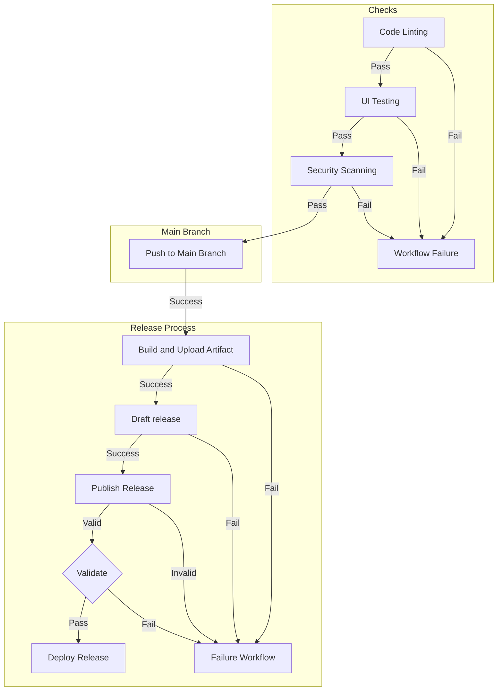

# :test_tube: Review of Workshop Outcome

## Recap

## Observations

Let us observe the outcome of the exercises we have completed as a whole.

1. Navigate to the `Actions` tab and verify the workflows are running (or have completed running).
2. Check the tag was created on the repository.
3. Check the release was created on the repository.
4. Check the release was created on the repository.
