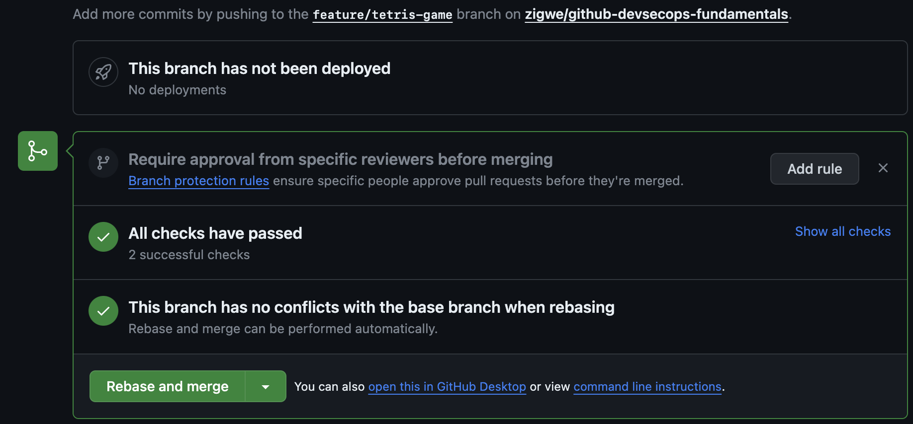
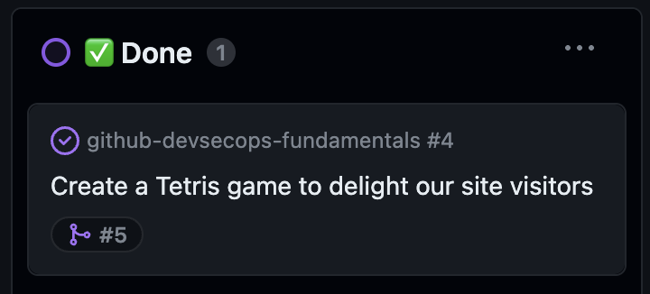
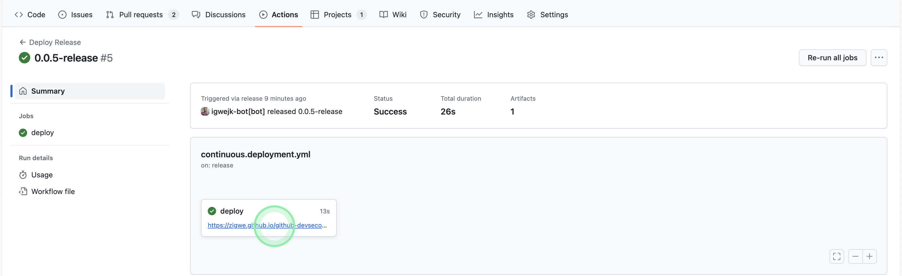

# :test_tube: Continuous Deployment

<!-- markdownlint-disable MD033 MD036 MD046 -->

!!! quote ":octicons-milestone-16: Deliver high quality value at speed"

    > Continuous deployment (CD) is the practice of using automation to publish and deploy software updates.
    >
    > To ultimately fulfill our goal on complete development of the feature, we altogether apply the practice of continuous deployment to validate and ship the value to our customers at high velocity.

    

---

## Exercise: Automate Deployment of Releases

The previous exercise walked us through automating the publication of release. We will continue to build upon that milestone to automate deployment of published releases.

---

### **:material-numeric-1-circle: Implement Deployment Workflow**

In the file explorer, create a new workflow `.github/workflows/continuous.deployment.yml` as follows.

```yaml title=".github/workflows/continuous.deployment.yml" linenums="1" hl_lines="3-6 8-10 25-27 36-40 42-65 67-71 73-77"
--8<-- "reference.implementations/workflows/3.continuous.deployment.yml"
```

---

#### Analysis

- **Lines `3 - 6`**

    Deployments will be triggered in the event of a release publication.

- **Lines `8 - 10`**

    Ensure that only a single job or workflow using the same concurrency group will run at a time.

    When a concurrent job or workflow is queued, if another job or workflow using the same concurrency group in the repository is in progress, the queued job or workflow will be pending. Any previously pending job or workflow in the concurrency group will be canceled. If you do not wish to also cancel any currently running job or workflow in the same concurrency group, specify `cancel-in-progress: false`.

- **Lines `25 - 27`**

    This will cause the URL of the deployed site to be displayed where the workflow is executed.

- **Lines `36 - 40`**

    This step enables [GitHub Pages](https://docs.github.com/en/pages/getting-started-with-github-pages/about-github-pages) and extracts various metadata about a site. It can also be used to configure various static site generators we support as starter workflows.

- **Lines `42 - 65`**

    Download assets associated with the release publication that triggered this workflow, and where necessary, adjust permissions for the files in the assets.

- **Lines `67 - 71`**

    Upload the site artifacts to the storage location where it should be ultimately collected by the next step for deployment.

- **Lines `73 - 77`**

    This step deploys the site.

---

### **:material-numeric-2-circle: Commit and publish your changes**

!!! tip "You can link your changes to an issue"

    Recall the issue you created earlier and its respective issue number, you will use it to link your current changes to the issue.

```bash linenums="1"
git add .
git commit -m "$(printf 'Create a tetris game to drive site engagement\n\n-Implement continuous deployment\n\n- Resolves #<ISSUE-NUMBER>')"
git push origin feature/tetris-game
```

---

### **:material-numeric-3-circle: Merge your open pull request**

- On the pull request page, open the drop-down from the <span class="gh-button-green">Merge pull request <span class="gh-button-green-with-dropdown">:material-menu-down:</span></span> button to choose the **Rebase and merge** option.

- Then press the <span class="gh-button-green">Rebase and merge <span class="gh-button-green-with-dropdown">:material-menu-down:</span></span> button to merge your pull request.

    { style="width: 25em;" }

- Finally, press <span class="gh-button-green">Confirm rebase and merge</span>.

When you merge the open pull request, you should make the following observations.

{==

**Collaboration**

- The linked issue in your project board automatically gets closed and moved to the **✅ Done** column of the board.

    { style="width: 25em;" }

**Automation**

When you head over to the **:octicons-play-16: Actions** tab on your repository, and notice...

- The `Version Changes to the Main Branch` workflow is executed.
- The `Package Delivery Artifacts & Create Release` workflow is executed.

    Consequently the release is announced in **:octicons-comment-discussion-16: Discussions**.
    { style="width: 25em;" }

- The `Deploy Release` workflow is executed.

    And on successful completion of the workflow, the public URL to your site is displayed on the job.

    { style="width: 25em;" }

**Stakeholder Enablement**

Stakeholders can easily explore deployments of the project.

- Deployments summary on repository home.

    { style="width: 25em;" }

- Detailed deployment environments list.

    { style="width: 25em;" }

==}

---

## 📚 Resources

- [Using environments for deployment](https://docs.github.com/en/actions/deployment/targeting-different-environments/using-environments-for-deployment)
- [Creating custom deployment protection rules](https://docs.github.com/en/actions/deployment/protecting-deployments/creating-custom-deployment-protection-rules)
- [Security harden deployments with OpenID Connect](https://docs.github.com/en/actions/deployment/security-hardening-your-deployments/about-security-hardening-with-openid-connect)

---
