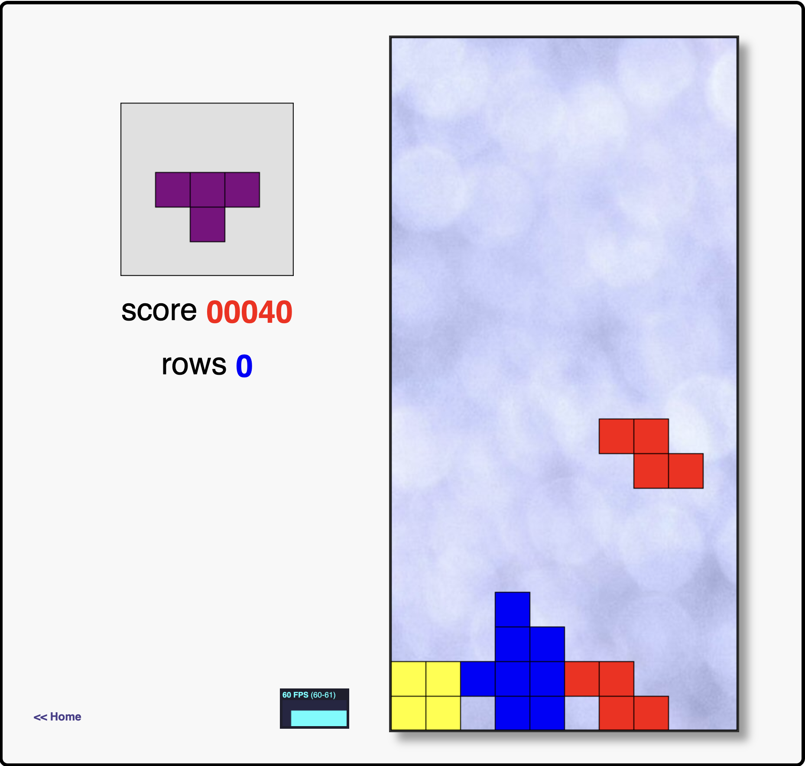

# :fontawesome-solid-flask-vial: Introduction

!!! quote ":octicons-milestone-16: Workshop Exercises"

    The workshop exercises provide guidance for implementing DevSecOps at the fundamental level with the GitHub platform. On completion, you would have gained the exposure to enable you seamlessly implement DevSecOps capabilities such as

    - [x] Continuous collaboration
    - [x] Continuous planning
    - [x] Continuous integration
    - [x] Continuous delivery
    - [x] Continuous quality
    - [x] Continuous security

    This workshop site also serves as the ***product*** we shall target for development. And During the course of the exercises, you will discover how you can rapidly build and test the site locally, and implement standardized tests to enable automated quality checks on the site.

    ---

    ## **:material-numeric-1-circle: Workshop Scenario**

    You are working in a team that owns **_this_** site, and a new business goal has come into the vision of your organisation. In order to grow engagement with the site...

    > _...the goal is to create a **Tetris Game** to delight our site visitors._

    <figure markdown>
        { loading=lazy }
        <figcaption>Outcome: Tetris Game</figcaption>
    </figure>

    ---

    ## **:material-numeric-2-circle: Milestones**

    The workshop objectives will be delivered by completion of the following milestones

    

    - [x] Collaborate

          Facilitate onboarding into the site project and enable project development at high velocity for stakeholders of different experience with the project.

    - [x] Secure the software supply chain

          Seamlessly implement application security and secure the software supply chain.

    - [x] Automate Deployment of Releases

          Reliably deliver value to the end-user at high velocity.
