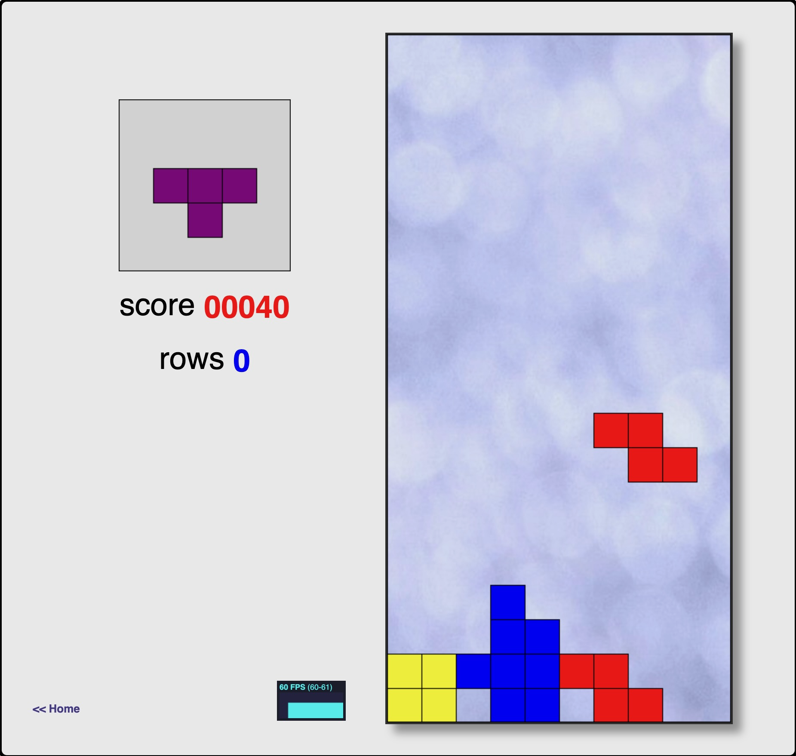

<!-- markdownlint-disable MD033 MD046 -->

# :fontawesome-solid-flask-vial: Introduction

!!! quote ":octicons-milestone-16: Create a **Tetris Game**"

    The exercises provide you guidance for implementing DevSecOps at the fundamental level with the GitHub platform. On completion, you would have gained the experience to seamlessly implement capabilities in

    - [x] continuous collaboration
    - [x] continuous planning
    - [x] continuous integration
    - [x] continuous delivery
    - [x] continuous quality
    - [x] continuous security

    ---

    === "**Workshop Scenario**"

        You are working in a team that owns _this_ site, and a new business goal has come into the vision of your organisation. In order to grow engagement with the site...

        <br />
        > _...the goal is to create a **Tetris Game** to delight our site visitors._

        <br />
        <figure markdown>
            { loading=lazy }
            <figcaption>Outcome: Tetris Game</figcaption>
        </figure>

    === "**Milestones**"

        The workshop objectives will be delivered by completion of the following milestones

        

        - [x] Collaboration

              Facilitate onboarding into the site project and enable project development at high velocity for stakeholders of different experience with the project.

        - [x] Securing the software supply chain

              Seamlessly implement application security and secure the software supply chain.

        - [x] Release automation

              Get value to the end-user faster.

    === "Process Outcome"

        High Level Continuous Deployment Architecture

        ```{ .mermaid }

        sequenceDiagram
            actor D as Developer
            actor R as Reviewers

            participant GBF as Git Branch (Feature) & PR
            participant GMQ as GitHub Merge Queue
            participant GBM as Git Branch (Main)

            participant GT as Git Tag
            participant DR as GitHub Docker Registry
            participant GR as GitHub Release
            participant ST as Staging
            participant PRD as Production

            D->>GBF: Pushes & opens
            activate GBF
            GBF->>GBF: Continuous Integration
            deactivate GBF

            GBF--)+R: Notify changes
            R->>-GBF: Approves
            GBF--)GMQ: Creates/Updates

            activate GMQ
            GMQ->>GMQ: Continuous Integration
            deactivate GMQ

            GMQ->>GBM: Merges
            activate GBM
            GBM->>GBM: Versioning
            GBM->>GT: Creates
            deactivate GBM


            activate GT
            GT->>GT: Continuous Delivery
            GT--xDR: Pushes
            deactivate GT

            D->>GR: Creates a Pre-Release
            activate GR
            GR->>GR: Continuous Deployment (Staging)
            GR--xST: Deploys
            deactivate GR

            D->>GR: Creates a Release
            activate GR
            GR->>GR: Continuous Deployment (Production)
            GR--xPRD: Deploys
            deactivate GR
        ```
