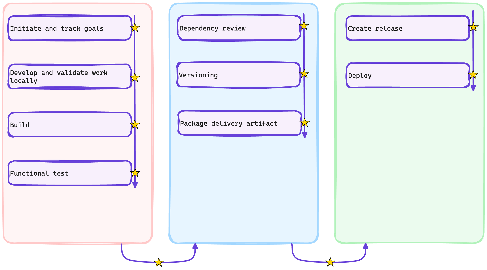

# :test_tube: Review of Workshop Outcomes

So far, we have reached the following milestones, learning to

- [x] Track work on GitHub
- [x] Rapidly onboard onto an existing project
- [x] Work in a collaborative manner, and enable quick incorporation of feedbacks
- [x] Efficiently secure the software supply chain, catching vulnerabilities and non-compliant dependencies as they are introduced
- [x] Automate versioning
- [x] Automate releases
- [x] Implement continuous deployment
