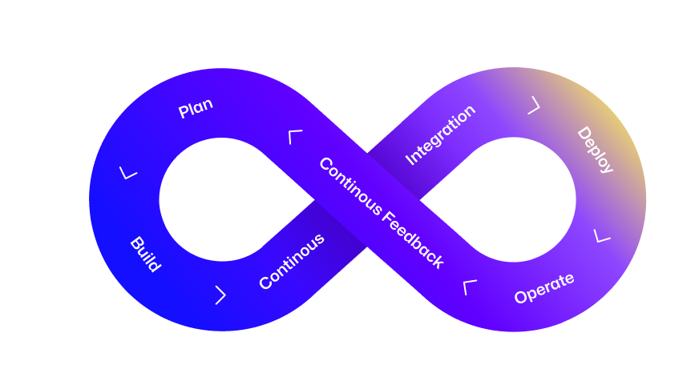

<!-- markdownlint-disable MD033 -->

# :octicons-mark-github-16: GitHub DevSecOps Fundamentals | Workshop, GitHub Universe 2023

This self-paced workshop will enable you acquire the capabilities to implement a DevSecOps mindset, leveraging the GitHub platform for a seamless developer experience.

!!! success ""

    ## :octicons-goal-16: Learning Objectives

    - [x] Collaborate effectively for high-velocity productivity
    - [x] Apply preventive security to every aspect of the development process
    - [x] Implement a secure software supply chain
    - [x] Automate product release and business processes in general
    - [x] Remove complications due to tool-bloat

     
    [Complete the **:footprints: Prerequisites** checklist.](./prerequisites.md){ .md-button .md-button--primary }

    ## :books: Resources

    - [Secure at every step](https://github.com/features/security)
    - [Start coding instantly with Codespaces](https://github.com/features/codespaces)
    - [Create diagrams to convey information through charts and graphs](https://docs.github.com/en/get-started/writing-on-github/working-with-advanced-formatting/creating-diagrams)
    - [Include diagrams in your Markdown files with Mermaid](https://github.blog/2022-02-14-include-diagrams-markdown-files-mermaid/)
    - [Security hardening for GitHub Actions](https://docs.github.com/en/actions/security-guides/security-hardening-for-github-actions)
    - [Security harden deployments with OpenID Connect](https://docs.github.com/en/actions/deployment/security-hardening-your-deployments/about-security-hardening-with-openid-connect)
