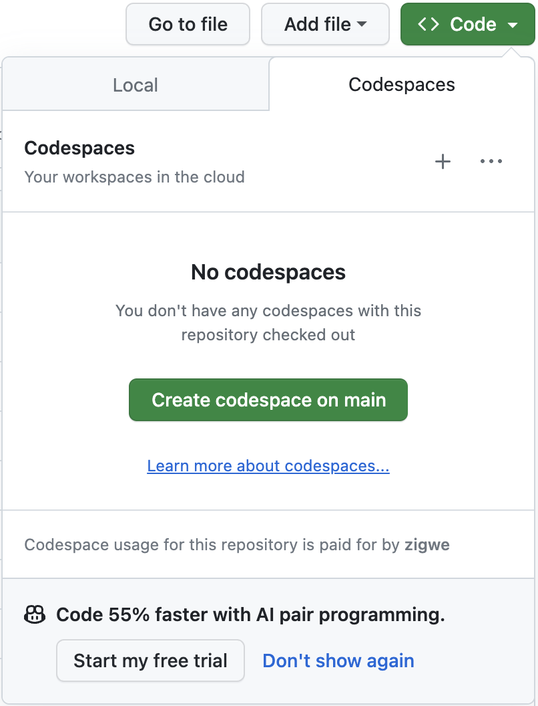

<!-- markdownlint-disable MD033 -->

# :octicons-mark-github-16: GitHub DevSecOps Fundamentals | Workshop, GitHub Universe 2023

This self-paced workshop will enable you acquire the capabilities to implement a DevSecOps mindset, leveraging the GitHub platform for a seamless developer experience.

## :octicons-goal-16: Learning Objectives

- [x] Collaborate effectively for high-velocity productivity
- [x] Apply preventive security to every aspect of the development process
- [x] Secure the software supply chain
- [x] Automate product release and business processes in general

!!! quote "Target Audience"

    For participants at the start of their DevSecOps journey, the workshop addresses the following key concerns:

    - How do I align the quest for high velocity delivery with the goals and visions of my organization?
    - How do I efficiently develop a project and manage code?
    - How do I securely package artifacts and store them for distribution?
    - How do I securely deploy artifacts/packages?
    - How do I generally automate processes in the business?

    For the experts who are further along or advanced in their DevSecOps adoption journey, the workshop provides guidance and challenges you to reduce complications in the implementation of DevSecOps practices:

    - How do I consolidate tools and remove complications due to tool-bloat?
    - How do I simplify the software supply chain process?

## :footprints: Prerequisites

!!! tip "Prepare before the workshop"

    To ensure a seamless workshop experience, complete the following checklist items in order.

    1. :fontawesome-brands-github-alt:{ .lg .middle } **Set up a GitHub account**

        Login to your GitHub  You may create a new GitHub account, if you do not already have one. (1)
        { .annotate }

        1.  :bulb: Keep your @handle handy.

        [:material-mouse: Create a new GitHub account](https://github.com/signup){:target="\_blank"}
          

    1. :material-source-repository-multiple:{ .lg .middle } **Clone the workshop project to your own account**

        1. [:material-mouse: Create workshop project](https://github.com/new?template_owner=githubuniverseworkshops&template_name=github-devsecops-fundamentals&owner=%40me&name=github-devsecops-fundamentals&description=GitHub+DevSecOps+Fundamentals+%7C+GitHub+Universe+2023+workshop&visibility=public){:target="\_blank"}
        1. In the new tab, most of the prompts will automatically fill in for you.

             - For owner, choose your personal account.
             - We recommend creating a public repository. (1)
                { .annotate }

                1.  :bulb: Public repositories benefit from
                    - [Free use of GitHub Actions minutes](https://docs.github.com/en/billing/managing-billing-for-github-actions/about-billing-for-github-actions).
                    - [Free use of GitHub Advanced Security features](https://docs.github.com/en/get-started/learning-about-github/about-github-advanced-security#about-advanced-security-features).
             - Scroll down and click the **Create repository** button at the bottom of the form.

                 
        1. After your new repository is created, wait about 20 seconds, then refresh the page.
          

    1. :material-security:{ .lg .middle } **Configure base security**

        1. Navigate to the :octicons-gear-16: Settings tab on your new workshop repository.
        2. Under the Security section of the menu, select :octicons-codescan-16: Code security and analysis. Then configure the settings to match as follows.

            
          

    2. :octicons-codespaces-16: **Provision a new cloud development environment for the workshop**

        GitHub Codespaces enables you to instantly start coding on the workshop project. Personal accounts on GitHub can benefit from a [free quota of GitHub Codespaces usage](https://docs.github.com/en/billing/managing-billing-for-github-codespaces/about-billing-for-github-codespaces#monthly-included-storage-and-core-hours-for-personal-accounts).

        1. Open the :octicons-code-16: Code :material-menu-down: menu and click on :material-mouse: Create codespaces on main.

        2. {==

            **Leave the development environment to initialize and run, we will come back to use it later.**

           ==}

        

## :books: Resources

- [ ]
- [Start coding instantly with Codespaces](https://github.com/features/codespaces)
- [Create diagrams to convey information through charts and graphs](https://docs.github.com/en/get-started/writing-on-github/working-with-advanced-formatting/creating-diagrams)
- [Include diagrams in your Markdown files with Mermaid](https://github.blog/2022-02-14-include-diagrams-markdown-files-mermaid/)
- [Security hardening for GitHub Actions](https://docs.github.com/en/actions/security-guides/security-hardening-for-github-actions)
- [Security harden deployments with OpenID Connect](https://docs.github.com/en/actions/deployment/security-hardening-your-deployments/about-security-hardening-with-openid-connect)
