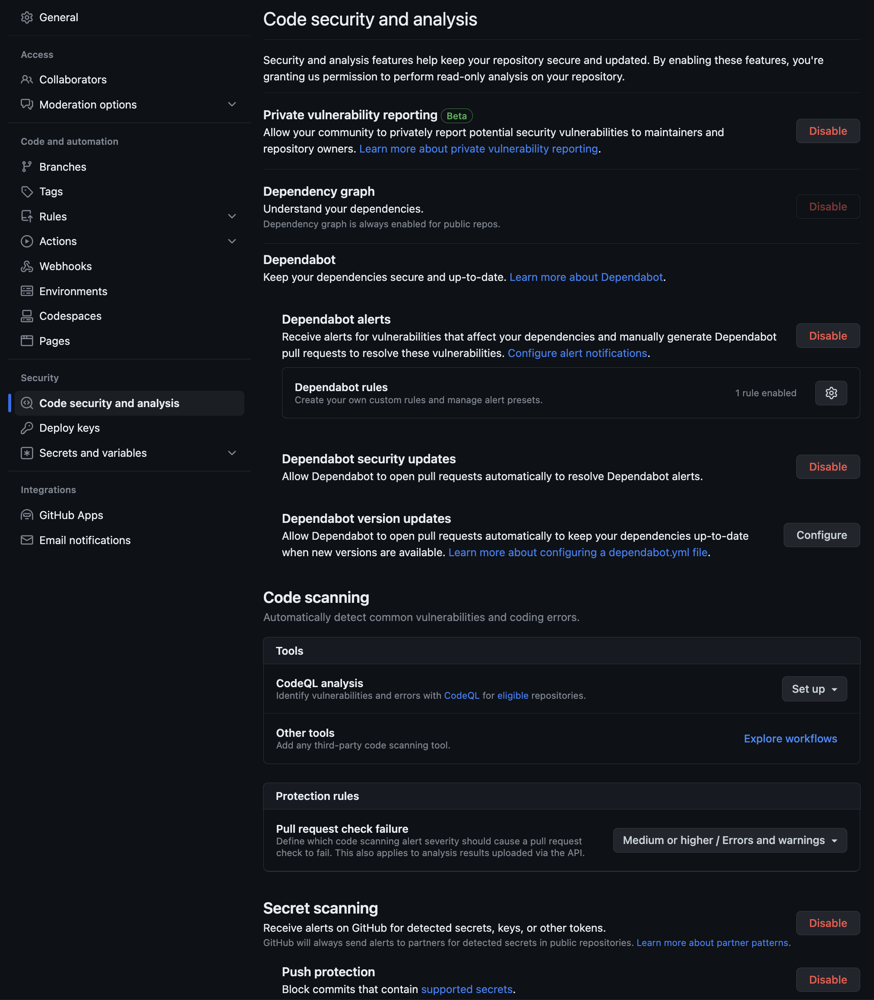
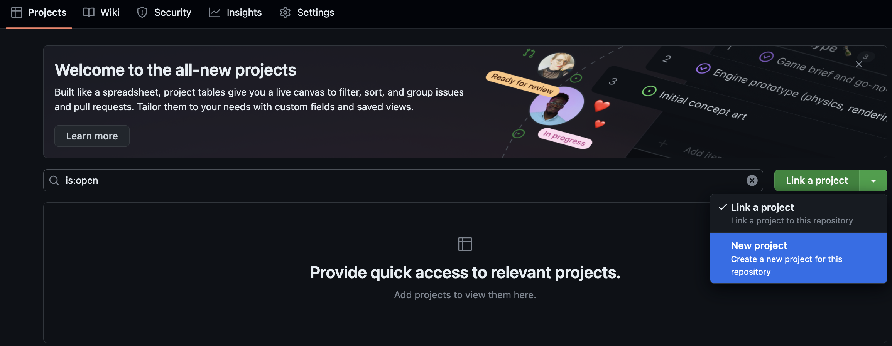
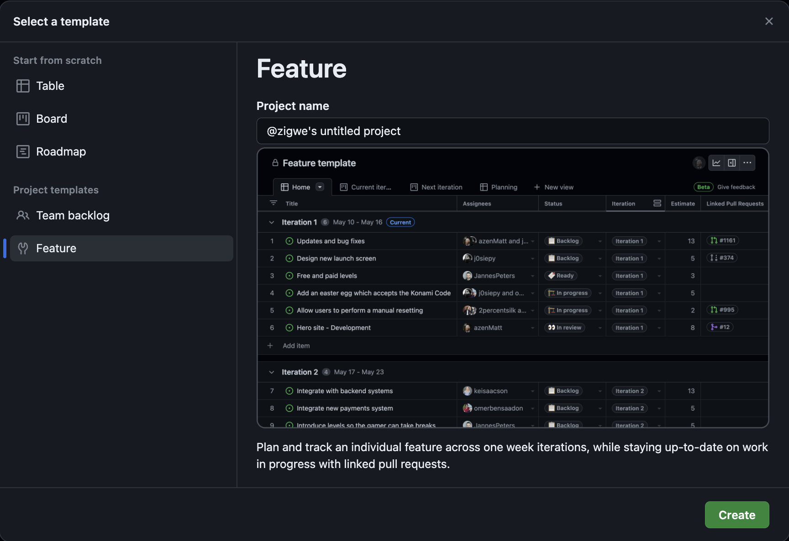
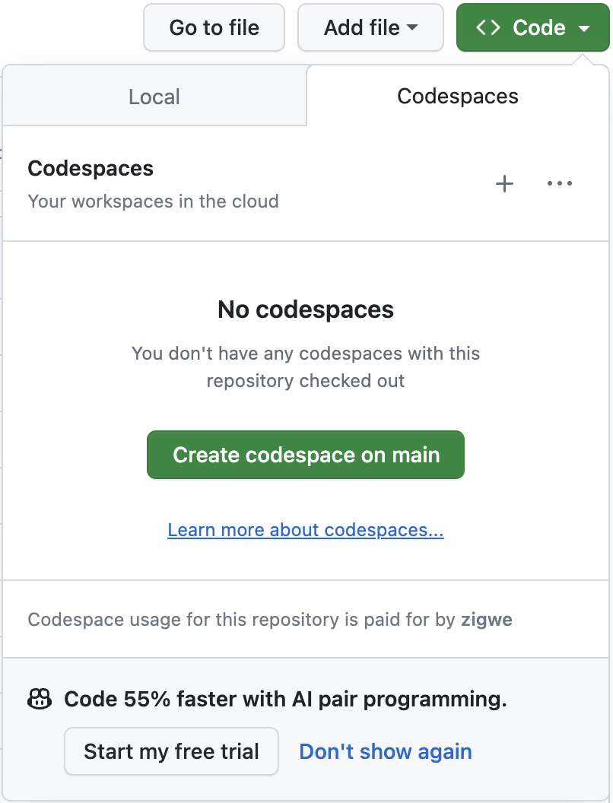

# :footprints: Prerequisites

!!! tip "Prepare before the workshop"

    To ensure a seamless workshop experience, complete the following checklist items in order.

    1. :fontawesome-brands-github-alt:{ .lg .middle } **Set up a GitHub account**

        Login to your GitHub  You may create a new GitHub account, if you do not already have one. (1)
        { .annotate }

        1.  :bulb: Keep your @handle handy.

        [:material-mouse: Create a new GitHub account](https://github.com/signup){:target="\_blank"}
          

    1. :material-source-repository-multiple:{ .lg .middle } **Clone the workshop project to your own account**

        1. [:material-mouse: Create workshop project](https://github.com/new?template_owner=githubuniverseworkshops&template_name=github-devsecops-fundamentals&owner=%40me&name=github-devsecops-fundamentals&description=GitHub+DevSecOps+Fundamentals+%7C+GitHub+Universe+2023+workshop&visibility=public){:target="\_blank"}
        1. In the new tab, most of the prompts will automatically fill in for you.

             - For owner, choose your personal account.
             - We recommend creating a public repository. (1)
                { .annotate }

                1.  :bulb: Public repositories benefit from
                    - [Free use of GitHub Actions minutes](https://docs.github.com/en/billing/managing-billing-for-github-actions/about-billing-for-github-actions).
                    - [Free use of GitHub Advanced Security features](https://docs.github.com/en/get-started/learning-about-github/about-github-advanced-security#about-advanced-security-features).
             - Scroll down and click the **Create repository** button at the bottom of the form.

                 
        1. After your new repository is created, wait about 20 seconds, then refresh the page.
          

    1. :octicons-feed-discussion-16: **Enable Discussions**

        [:material-mouse: Enabling GitHub Discussions on your repository](https://docs.github.com/en/discussions/quickstart#enabling-github-discussions-on-your-repository){:target="\_blank"}
          

    1. :material-security:{ .lg .middle } **Configure base security**

        1. Navigate to the :octicons-gear-16: Settings tab on your new workshop repository.
        2. Under the Security section of the menu, select :octicons-codescan-16: Code security and analysis. Then configure the settings to match as follows (by clicking Enable where the option is/becomes available).

            
          

    1. :octicons-project-16:{ .lg .middle } **Create a project board for the repository**

        1. Open the workshop repository in a new tab.

        2. Navigate to the :octicons-project-template-16: Projects tab on your new workshop repository.

        3. Open the :octicons-code-16: Link a project :material-menu-down: dropdown menu. Then select the **New Project** option.

            

        4. Click on the :octicons-code-16: New project :material-menu-down: button to start the project creation wizard.
        5. Select the **:octicons-tools-16: Feature** template.
        6. Finally click on the Create button.
            

    2. :octicons-codespaces-16: **Provision a new cloud development environment for the workshop**

        GitHub Codespaces enables you to instantly start coding on the workshop project. Personal accounts on GitHub can benefit from a [free quota of GitHub Codespaces usage](https://docs.github.com/en/billing/managing-billing-for-github-codespaces/about-billing-for-github-codespaces#monthly-included-storage-and-core-hours-for-personal-accounts).

        1. Navigate to the :octicons-code-16: Code tab.

        2. Open the :octicons-code-16: Code :material-menu-down: menu and click on :material-mouse: Create codespaces on main.

        3. {==

            **Leave the development environment to initialize and run, we will come back to use it later.**

           ==}

        
