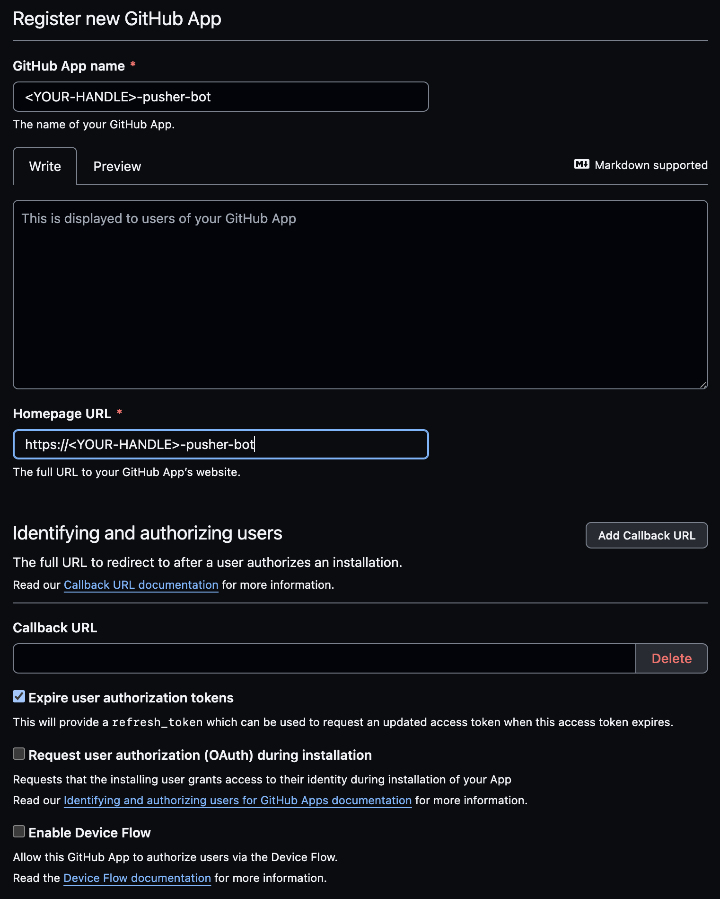
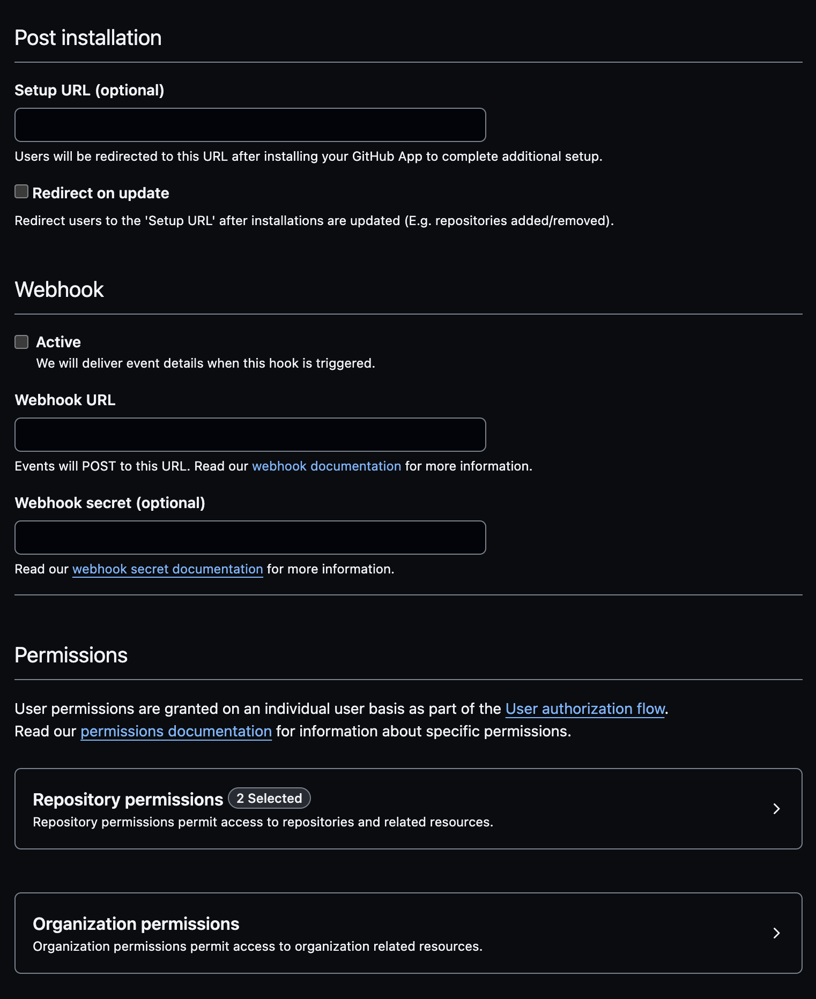
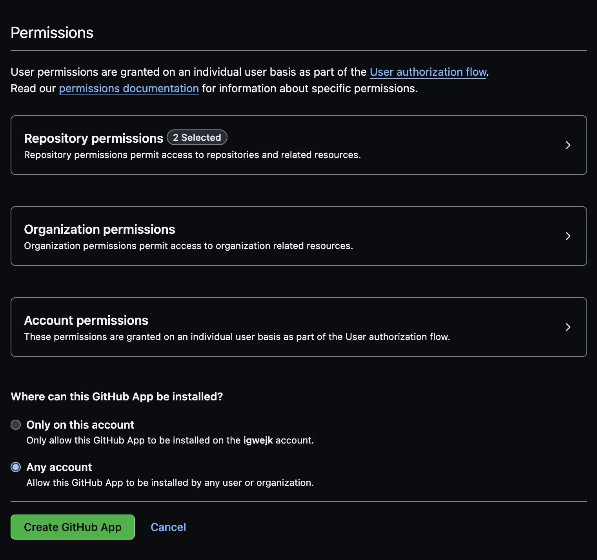

# :footprints: Prerequisites

To ensure a seamless workshop experience, complete the following checklist items in order.

!!! tip "Prepare before the workshop"

    1. ## :fontawesome-brands-github-alt:{ .lg .middle } **Set up a GitHub account**

        Login to your GitHub  You may create a new GitHub account, if you do not already have one. (1)
        { .annotate }

        1.  :bulb: Keep your **@handle** handy.

        [:material-mouse: Create a new GitHub account](https://github.com/signup){.md-button target="\_blank"}
          
        ---

    2. ## :material-source-repository-multiple:{ .lg .middle } **Clone the workshop project to your own account**

        1. [:material-mouse: Create workshop project](https://github.com/new?template_owner=githubuniverseworkshops&template_name=github-devsecops-fundamentals&owner=%40me&name=github-devsecops-fundamentals&description=GitHub+DevSecOps+Fundamentals+%7C+GitHub+Universe+2023+workshop&visibility=public){.md-button target="\_blank"}
        2. In the new tab, most of the prompts will automatically fill in for you.

             - For owner, choose your personal account.
             - We recommend creating a public repository. (1)
               { .annotate }

                 1.  :bulb: Public repositories benefit from

                     - [Free use of GitHub Actions minutes](https://docs.github.com/en/billing/managing-billing-for-github-actions/about-billing-for-github-actions).
                     - [Free use of GitHub Advanced Security features](https://docs.github.com/en/get-started/learning-about-github/about-github-advanced-security#about-advanced-security-features).
             - Scroll down and click the Create repository button at the bottom of the form.

                ??? info "Example view"

                    
        3. After your new repository is created, wait about 20 seconds, then refresh the page.
          
        ---

    3. ## :octicons-feed-discussion-16: **Enable Discussions**

        [:material-mouse: Enabling GitHub Discussions on your repository](https://docs.github.com/en/discussions/quickstart#enabling-github-discussions-on-your-repository){.md-button target="\_blank"}
          
        ---

    4. ## :material-security:{ .lg .middle } **Configure base security**

        1. Navigate to the :octicons-gear-16: Settings tab on your new workshop repository.
        2. Under the Security section of the menu, select :octicons-codescan-16: Code security and analysis. Then configure the settings to match as follows (by clicking Enable where the option is/becomes available).

            ??? info "Example view"

                
        ---

    5. ## :octicons-dependabot-16:{ .lg .middle } **Create a GitHub App**

          1. Goto to the profile menu at the top-right corner

            - :material-button-cursor: &nbsp;&nbsp; **:octicons-gear-16: Settings**
              - :material-button-cursor: &nbsp;&nbsp; **:octicons-code-16: Developer settings**
                  - :material-button-cursor: &nbsp;&nbsp; **:octicons-apps-16: GitHub Apps**
                      - :material-button-cursor: &nbsp;&nbsp; **New GitHub App**

            ??? info "Provide the form fields value as demonstrated here"

                
                
                

                On **Repository permissions**, select **`Read and write`** for the **`Contents`** scope.

            - [Generate a private key](https://docs.github.com/en/apps/creating-github-apps/authenticating-with-a-github-app/managing-private-keys-for-github-apps#generating-private-keys){.md-button target="\_blank"}
            - Goto `https://github.com/apps/<YOUR-HANDLE>-pusher-bot`. Install the app in the repository.
            - Save app private key to secrets
            - Save appid to vars

            !!! tip "Why a GitHub App is required"

                > When you use the repository's `GITHUB_TOKEN` to perform tasks, events triggered by the `GITHUB_TOKEN`, with the exception of `workflow_dispatch` and `repository_dispatch`, will not create a new workflow run. This prevents you from accidentally creating recursive workflow runs. For example, if a workflow run pushes code using the repository's `GITHUB_TOKEN`, a new workflow will not run even when the repository contains a workflow configured to run when push events occur.
                >
                > If you do want to trigger a workflow from within a workflow run, you can use a GitHub App installation access token or a personal access token instead of `GITHUB_TOKEN` to trigger events that require a token.
                >
                > If you use a GitHub App, you'll need to create a GitHub App and store the app ID and private key as secrets.
                >
                > ~[Triggering a workflow from a workflow](https://docs.github.com/en/actions/using-workflows/triggering-a-workflow#triggering-a-workflow-from-a-workflow)

        ---

    6.  ## :octicons-project-16:{ .lg .middle } **Create a project board for the repository**

        1. Open the workshop repository in a new tab.

        2. Navigate to the :octicons-project-template-16: Projects tab on your new workshop repository.

        3. Open the :octicons-code-16: Link a project :material-menu-down: dropdown menu. Then select the **New Project** option.

            ??? info "Example view"
                

        4. Click on the :octicons-code-16: New project :material-menu-down: button to start the project creation wizard.
        5. Select the **:octicons-tools-16: Feature** template.
        6. Finally click on the Create button.

            ??? info "Example view"
                
        ---

    7.  ## :octicons-codespaces-16: **Provision a new cloud development environment for the workshop**

        GitHub Codespaces enables you to instantly start coding on the workshop project. Personal accounts on GitHub can benefit from a [free quota of GitHub Codespaces usage](https://docs.github.com/en/billing/managing-billing-for-github-codespaces/about-billing-for-github-codespaces#monthly-included-storage-and-core-hours-for-personal-accounts).

        1. Navigate to the :octicons-code-16: Code tab.

        2. Open the :octicons-code-16: Code :material-menu-down: menu and click on :material-mouse: Create codespaces on main.

            ??? info "Example view"
                

        3. {==

            **Leave the development environment to initialize and run, we will come back to use it later.**

           ==}

        ---
