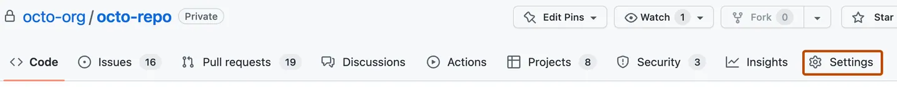

# :footprints: Prerequisites

<!-- markdownlint-disable MD033 -->

!!! tip "Prepare before the workshop"

    To ensure a seamless workshop experience, complete the following checklist items in order.

## :material-numeric-1-circle: :fontawesome-brands-github-alt:{ .lg .middle } **Set up a GitHub account**

Login to your GitHub account.

You may create a new GitHub account, if you do not already have one. (1)
{ .annotate }

1. :bulb: Clicking the button below will open the page on a new tab, for you to create a new GitHub account. Keep your **`@handle`** handy after you have logged in.

[:material-cursor-default-click: Create a new GitHub account](https://github.com/signup){.md-button target="\_blank"}

<br />

---

## :material-numeric-2-circle: :material-source-repository-multiple:{ .lg .middle } **Clone the workshop project to your own account**

1. [:material-cursor-default-click: Create workshop project](https://github.com/new?template_owner=githubuniverseworkshops&template_name=github-devsecops-fundamentals&owner=%40me&name=github-devsecops-fundamentals&description=GitHub+DevSecOps+Fundamentals+%7C+GitHub+Universe+2023+workshop&visibility=public){.md-button target="\_blank"}
1. In the new tab, most of the prompts will automatically fill in for you.

      - For owner, choose your personal account or.
      - We recommend creating a public repository. (1)
        { .annotate }

        1. :bulb: Public repositories benefit from

            - [Free use of GitHub Actions minutes](https://docs.github.com/en/billing/managing-billing-for-github-actions/about-billing-for-github-actions).
            - [Free use of GitHub Advanced Security features](https://docs.github.com/en/get-started/learning-about-github/about-github-advanced-security#about-advanced-security-features).

      - Scroll down and click the <span class="gh-button-green">Create repository</span> button at the bottom of the form.

        ??? info "Expand for sample view..."

            

1. After creation of your new repository has begun, wait about 20 seconds, then refresh the page.

<br />

---

## :material-numeric-3-circle: :octicons-feed-discussion-16: **Enable Discussions**

1. On GitHub.com, navigate to the main page of your new repository.
1. Under your repository name, click :octicons-gear-16: **Settings**.
    
1. Scroll down to the "Features" section and click <span class="gh-button-green">Set up discussions<span>

<br />

---

## :material-numeric-4-circle: :material-security:{ .lg .middle } **Configure base security**

1. Navigate to the :octicons-gear-16: **Settings** tab on your new workshop repository.
1. Under the "Security" section of the menu, select :octicons-codescan-16: **Code security and analysis**. Then configure the settings to match as follows (by clicking <span class="gh-repo-settings-button">Enable</span> where the option is/becomes available).

    ??? info "Expand for sample view..."

        

<br />

---

## :material-numeric-5-circle: :octicons-dependabot-16:{ .lg .middle } **Register a GitHub App**

<!--
<form action="https://github.com/settings/apps/new?state=abc123" method="post">
  <input
    required
    class="md-input md-input--stretch"
    type="text" name="handle" id="handle"
    placeholder="Enter your @handle here (without the '@')"
  />
  <input type="hidden" name="manifest" id="manifest">
  <input class="md-button" type="submit" value="Create App">
</form>
-->

1. In the upper-right corner of any page on GitHub, click your profile photo.
1. Navigate to your account **:octicons-gear-16: Settings**.
1. In the left sidebar, click **:octicons-code-16: Developer settings**.
1. In the left sidebar, click **:octicons-apps-16: GitHub Apps**
1. Click **New GitHub App**

    !!! note "Provide the form fields value as follows"

        ```text
        GitHub App Name..........: <YOUR-HANDLE>-bot

        Homepage URL.............: https://github.com/<YOUR-HANDLE>/github-devsecops-fundamentals

        Webhook
          Active.................: DESELECT

        Repository permissions
          Actions................: Read and write
          Contents...............: Read and write
          Deployments............: Read and write
          Discussions............: Read and write
          Pages..................: Read and write

        Where can this GitHub App be installed?
          Any account.................: SELECT
        ```

1. Generate a private key for the new GitHub App as documented in [**:eyes: here**](https://docs.github.com/en/apps/creating-github-apps/authenticating-with-a-github-app/managing-private-keys-for-github-apps#generating-private-keys){ target="\_blank" }.
1. Goto `https://github.com/apps/<YOUR-HANDLE>-bot`. Install the app in the repository you created earlier.
1. Save the GitHub App private key to your new repository's secrets under the name of `APP_PRIVATE_KEY_ACTIONS_ASSISTANT`.

    👀 [**Creating secrets for a repository**](https://docs.github.com/en/actions/security-guides/using-secrets-in-github-actions#creating-secrets-for-a-repository).

1. Save the GitHub App's `appid` to your new repository's variables under the name of `APP_ID_ACTIONS_ASSISTANT`.

    👀 [**Creating configuration variables for a repository**](https://docs.github.com/en/actions/learn-github-actions/variables#creating-configuration-variables-for-a-repository)

!!! question "What is the use of a GitHub App?"

    > _When you use the repository's `GITHUB_TOKEN` to perform tasks, events triggered by the `GITHUB_TOKEN`, with the exception of `workflow_dispatch` and `repository_dispatch`, will not create a new workflow run. This prevents you from accidentally creating recursive workflow runs. For example, if a workflow run pushes code using the repository's `GITHUB_TOKEN`, a new workflow will not run even when the repository contains a workflow configured to run when push events occur._
    >
    > _If you do want to trigger a workflow from within a workflow run, you can use a GitHub App installation access token or a personal access token instead of `GITHUB_TOKEN` to trigger events that require a token._
    >
    > _If you use a GitHub App, you'll need to create a GitHub App and store the app ID and private key as secrets._
    >
    > ~ [Triggering a workflow from a workflow](https://docs.github.com/en/actions/using-workflows/triggering-a-workflow#triggering-a-workflow-from-a-workflow)

    During the course of the workshop exercises, you will discover how the GitHub App is used to trigger the automatic deployment of release artifacts.

<br />

---

## :material-numeric-6-circle: :octicons-project-16:{ .lg .middle } **Create a project board for the repository**

1. Open the recently created workshop repository in a new tab.

2. Navigate to the :octicons-project-template-16: **Projects** tab on your new workshop repository.

3. Open the <span class="gh-button-green">:octicons-code-16: Link a project :material-menu-down:</span> dropdown menu. Then select the **New Project** option.

    ??? info "Expand for sample view..."
        

4. Click on the <span class="gh-button-green">:octicons-code-16: New project :material-menu-down:</span> button to start the project creation wizard.
5. Select the :octicons-people-16: **Team backlog** template.
6. Give a name to the project
7. Finally click on the <span class="gh-button-green">Create</span> button.

    ??? info "Expand for sample view..."
        

<br />

---

## :material-numeric-7-circle: :octicons-codespaces-16: **Provision a new cloud development environment for the workshop**

GitHub Codespaces enables you to instantly start coding on the workshop project. Personal accounts on GitHub can benefit from a [free quota of GitHub Codespaces usage](https://docs.github.com/en/billing/managing-billing-for-github-codespaces/about-billing-for-github-codespaces#monthly-included-storage-and-core-hours-for-personal-accounts).

1. Navigate to the :octicons-code-16: **Code** tab.

2. Open the <span class="gh-button-green">:octicons-code-16: Code :material-menu-down:</span> menu and click on :material-cursor-default-click: <span class="gh-button-green">Create codespaces on main</span>.

    ??? info "Expand for sample view..."
        { style="height: 40em"}

3. {==

    **Leave the development environment to initialize and run, we will come back to use it later.**

   ==}

<br />

---
